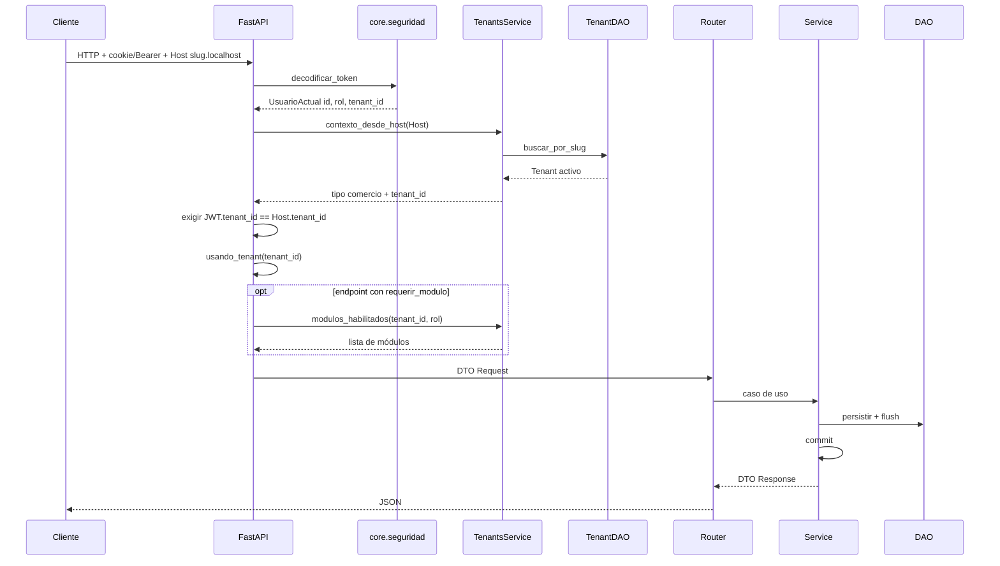
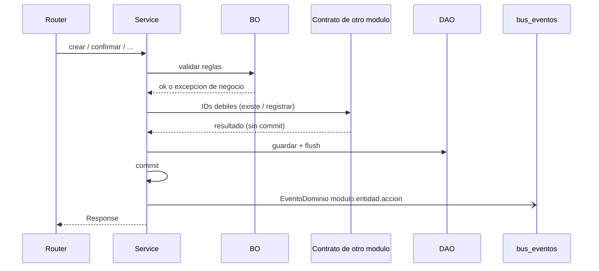

# Flujo transversal — request autenticado

Fuente: `app/core/dependencias.py`, `app/modulos/tenants/dependencias.py`, `app/modulos/ia/dependencias.py`, `app/core/eventos.py`.
Actualizado: 2026-09-05.

Casi todos los endpoints de comercio exigen cookie/Bearer JWT **y** que el Host sea el subdominio del tenant del usuario. El `tenant_id` se fija en contexto (`usando_tenant`) para filtrar filas sin ForeignKey entre módulos.

`exigir_usuario_del_comercio` corre en casi todos los routers de comercio. `modulos_habilitados` **no** se consulta en cada request: solo si el endpoint declara `Depends(requerir_modulo(...))`.

## Request de un comercio

## Capas dentro de un módulo

## Excepción: webhook n8n

`GET /api/v1/ai/webhook/resumen-dia` no usa JWT. Autentica con `X-Ventas360-Webhook-Secret` y fija el tenant con `X-Tenant-Slug` (`ia.dependencias`). Ver [ia.md](ia.md).

## Convenciones

- Errores: `RecursoNoEncontrado`, `ReglaDeNegocioViolada`, `NoAutenticado`, `NoAutorizado` → `{"error": {"codigo", "mensaje"}}`.
- Contratos **no hacen commit**; el service orquestador cierra la transacción.
- El bus es en memoria; un fallo en un manejador no revierte el commit.
