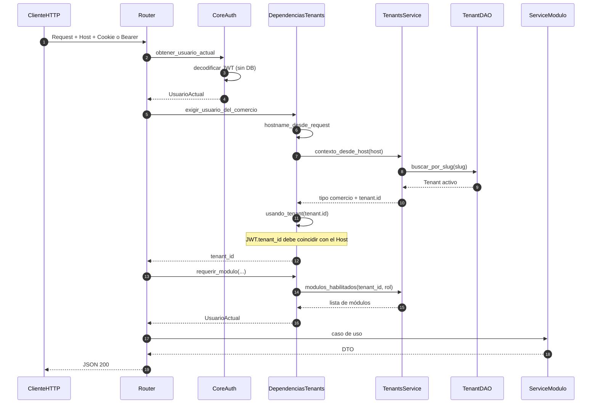

# Flujo transversal — autenticación, tenant y permisos

Fuentes: `app/core/dependencias.py`, `app/core/seguridad.py`, `app/modulos/tenants/dependencias.py`, `app/modulos/tenants/host.py`.

Casi todos los endpoints de comercio declaran:

```python
dependencies=[
    Depends(exigir_usuario_del_comercio),
    Depends(requerir_modulo("...")),
]
```

## Request autenticado de un comercio



## Errores unificados

`ErrorDeNegocio` (`NoAutenticado`, `NoAutorizado`, `RecursoNoEncontrado`, `ReglaDeNegocioViolada`) → handler en `app/main.py` → `{"error": {"codigo", "mensaje"}}`.
