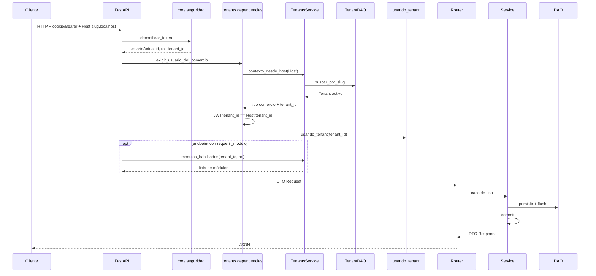
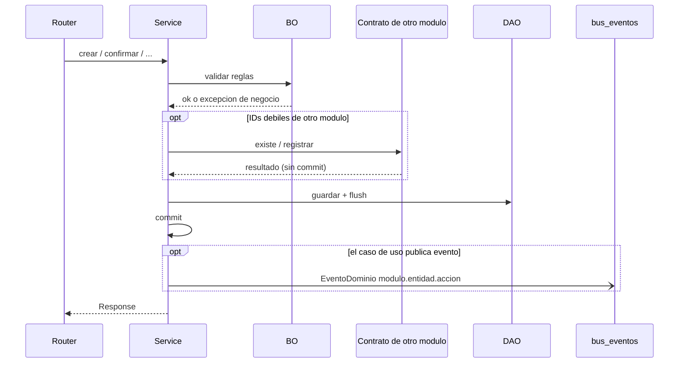

# Flujo transversal — request autenticado

Fuente: `app/core/dependencias.py`, `app/modulos/tenants/dependencias.py`, `app/modulos/ia/dependencias.py`, `app/core/eventos.py`.
Actualizado: 2026-11-11.

Casi todos los endpoints de comercio exigen cookie/Bearer JWT **y** que el Host sea el subdominio del tenant del usuario (`exigir_usuario_del_comercio`). El `tenant_id` se fija en contexto (`usando_tenant`) para filtrar filas sin ForeignKey entre módulos.

`modulos_habilitados` **no** corre en todo request: solo si el endpoint declara `Depends(requerir_modulo(...))`.

Excepciones sin JWT de comercio: `POST /auth/login`, `GET /tenants/contexto` (público por Host) y el webhook n8n.

## Request de un comercio

```mermaid
sequenceDiagram
    participant Cliente
    participant FastAPI
    participant JWT as core.seguridad
    participant DepTenant as tenants.dependencias
    participant TenantsSvc as TenantsService
    participant TenantDAO
    participant Ctx as usando_tenant
    participant Router
    participant Service
    participant DAO

    Cliente->>FastAPI: HTTP + cookie/Bearer + Host slug.localhost
    FastAPI->>JWT: decodificar_token
    JWT-->>FastAPI: UsuarioActual id, rol, tenant_id
    FastAPI->>DepTenant: exigir_usuario_del_comercio
    DepTenant->>TenantsSvc: contexto_desde_host(Host)
    TenantsSvc->>TenantDAO: buscar_por_slug
    TenantDAO-->>TenantsSvc: Tenant activo
    TenantsSvc-->>DepTenant: tipo comercio + tenant_id
    DepTenant->>DepTenant: JWT.tenant_id == Host.tenant_id
    DepTenant->>Ctx: usando_tenant(tenant_id)
    opt endpoint con requerir_modulo
        FastAPI->>TenantsSvc: modulos_habilitados(tenant_id, rol)
        TenantsSvc-->>FastAPI: lista de módulos
    end
    FastAPI->>Router: DTO Request
    Router->>Service: caso de uso
    Service->>DAO: persistir + flush
    Service->>Service: commit
    Service-->>Router: DTO Response
    Router-->>Cliente: JSON
```

## Capas dentro de un módulo

```mermaid
sequenceDiagram
    participant Router
    participant Service
    participant BO
    participant ContratoOtro as Contrato de otro modulo
    participant DAO
    participant Bus as bus_eventos

    Router->>Service: crear / confirmar / ...
    Service->>BO: validar reglas
    BO-->>Service: ok o excepcion de negocio
    opt IDs debiles de otro modulo
        Service->>ContratoOtro: existe / registrar
        ContratoOtro-->>Service: resultado (sin commit)
    end
    Service->>DAO: guardar + flush
    Service->>Service: commit
    opt el caso de uso publica evento
        Service-)Bus: EventoDominio modulo.entidad.accion
    end
    Service-->>Router: Response
```

No todos los services llaman contrato ajeno ni publican en el bus. El bus es en memoria; un fallo en un manejador no revierte el commit.

## Excepción: webhook n8n

`GET /api/v1/ai/webhook/resumen-dia` no usa JWT. Autentica con `X-Ventas360-Webhook-Secret` y fija el tenant con `X-Tenant-Slug` (`ia.dependencias`). Ver [ia.md](ia.md).

## Convenciones

- Errores: `RecursoNoEncontrado`, `ReglaDeNegocioViolada`, `NoAutenticado`, `NoAutorizado` → `{"error": {"codigo", "mensaje"}}`.
- Contratos **no hacen commit**; el service orquestador cierra la transacción.
