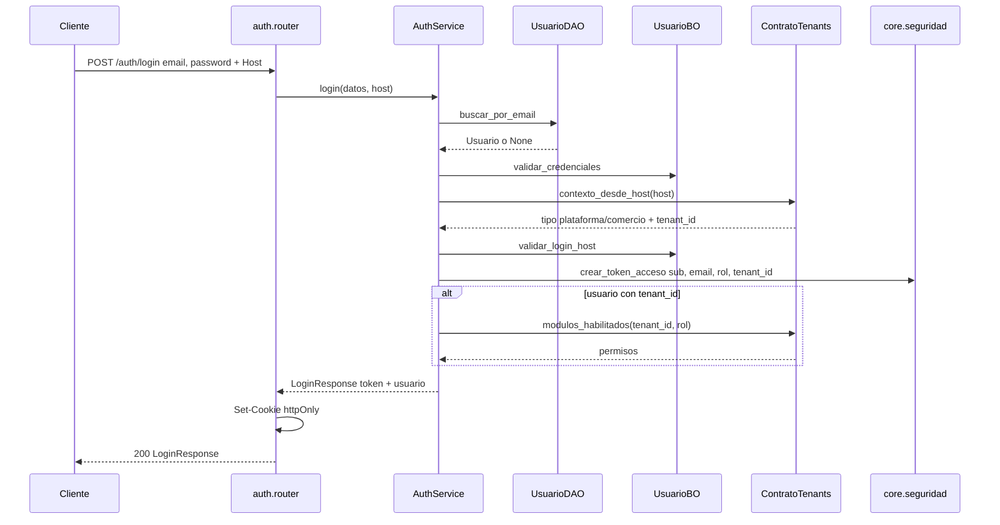

# auth — login

Fuente: `app/modulos/auth/` · Flujo principal: `POST /api/v1/auth/login`.
Actualizado: 2026-08-26.

Valida credenciales, que el Host coincida con el tenant del usuario (o plataforma para `superadmin`) y emite JWT en cookie httpOnly + body.

## Otros endpoints

| Método | Ruta | operation_id |
|--------|------|----------------|
| GET | `/auth/me` | `obtener_perfil` |
| POST | `/auth/logout` | `logout` (borra cookie) |
| GET/POST/DELETE | `/usuarios` | listar / crear / eliminar |
| GET/POST/DELETE | `/catalogos/vendedores` | vendedores (usuarios rol vendedor) |

## Contrato público

`ContratoAuth`: `existe_usuario`, `listar_por_rol`, `crear_administrador_inicial`, `listar_usuarios_de_tenant`, `primeros_administradores`, `cambiar_password_de_tenant`. Usado por **tenants** y **clientes**.
