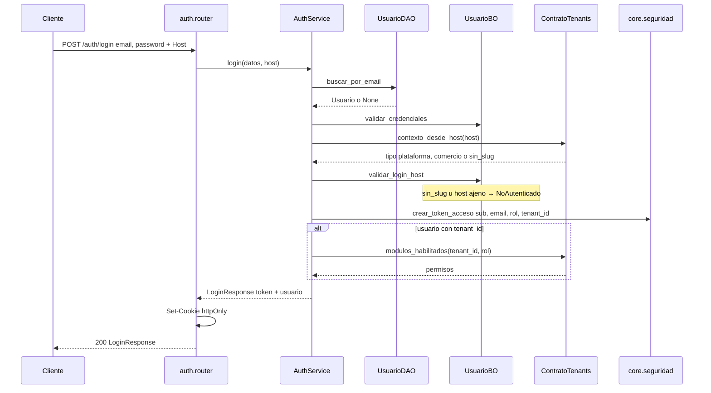

# auth — login

Fuente: `app/modulos/auth/` · Flujo principal: `POST /api/v1/auth/login`.
Actualizado: 2026-09-26.

Valida credenciales, que el Host coincida con el tenant del usuario (o plataforma para `superadmin`) y emite JWT en cookie httpOnly + body. No hay `commit` en el login.

`GET /auth/me` repite Host + `modulos_habilitados`. El alta de usuario asigna password inicial `cambiar12345` si el front no manda una. El alta rápida de vendedor crea email provisorio `vendedor-{uuid}@pendiente.ventas360`.

## Otros endpoints

| Método | Ruta | operation_id |
|--------|------|----------------|
| POST | `/auth/login` | `login` |
| GET | `/auth/me` | `obtener_perfil` |
| POST | `/auth/logout` | `logout` (borra cookie) |
| GET | `/usuarios` | `listar_usuarios` |
| POST | `/usuarios` | `crear_usuario` |
| DELETE | `/usuarios/{id}` | `eliminar_usuario` |
| GET | `/catalogos/vendedores` | `listar_vendedores` |
| POST | `/catalogos/vendedores` | `crear_vendedor` |
| DELETE | `/catalogos/vendedores/{id}` | `eliminar_vendedor` |

Usuarios y vendedores exigen módulo `configuracion` (listar vendedores también acepta `clientes`, `mostrador`, `cta_cte`, `ventas`).

## Contrato público

`ContratoAuth`: `existe_usuario`, `listar_por_rol`, `crear_administrador_inicial`, `listar_usuarios_de_tenant`, `primeros_administradores`, `cambiar_password_de_tenant`. Usado por **tenants** y **clientes**.
