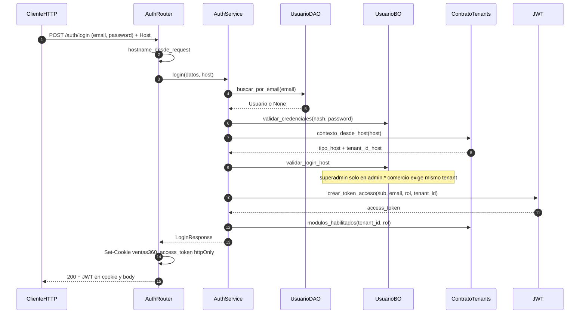

# auth — login por Host

Prefijo: `/api/v1/auth`, `/api/v1/usuarios`, `/api/v1/catalogos/vendedores`.
Fuentes: `app/modulos/auth/{router,service,bo,dao,contrato}.py`, `app/core/seguridad.py`.

## POST /auth/login (`operation_id`: `login`)

## Otros endpoints

| Método | Path | operation_id |
|--------|------|--------------|
| GET | `/auth/me` | `obtener_perfil` |
| POST | `/auth/logout` | `logout` (borra cookie, sin DB) |
| GET/POST | `/usuarios` | `listar_usuarios` / `crear_usuario` |
| GET/POST | `/catalogos/vendedores` | `listar_vendedores` / `crear_vendedor` |

Contrato expuesto: `ContratoAuth` (admin inicial, existe_usuario). Usa `ContratoTenants`.
