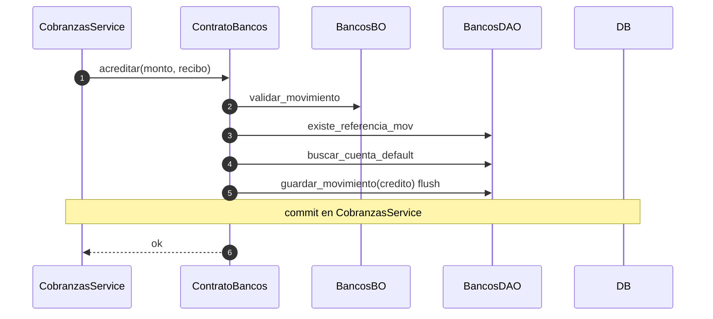
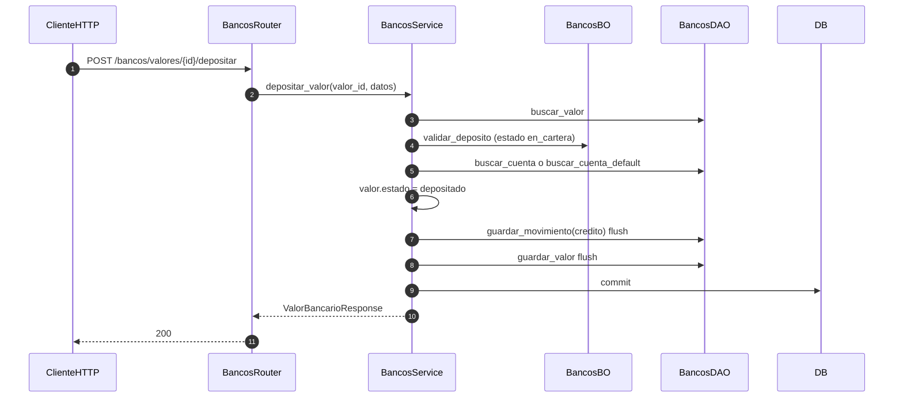

# bancos — acreditar (cobranzas) y depositar valor

Prefijo: `/api/v1/bancos`. Módulo HTTP: `compras`.
Fuentes: `app/modulos/bancos/{router,service,bo,dao,contrato}.py`.

## Contrato: acreditar (recibo transferencia)

## POST /bancos/valores/{id}/depositar (`operation_id`: `depositar_valor_bancario`)

Expone `ContratoBancos` (`acreditar`, `debitar`). Sin eventos.
