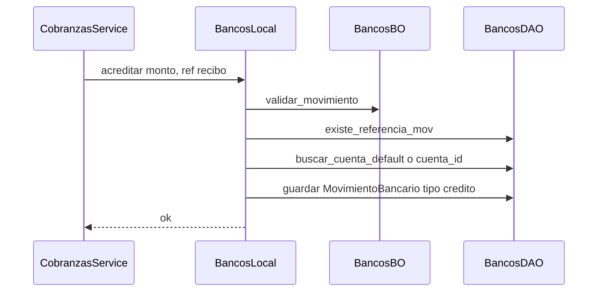
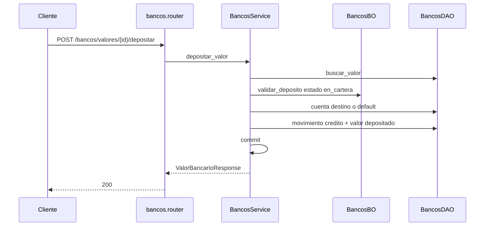

# bancos — acreditar y depositar valor

Fuente: `app/modulos/bancos/` · Flujos: `ContratoBancos.acreditar` (cobranzas transferencia) y `POST /api/v1/bancos/valores/{id}/depositar`.
Actualizado: 2026-08-26.

## Acreditar (contrato, misma TX que cobranzas)

## Depositar valor en cartera

## Otros endpoints

| Método | Ruta | operation_id |
|--------|------|----------------|
| GET/POST | `/bancos/cuentas` | listar / crear cuenta |
| GET | `/bancos/movimientos` | `listar_movimientos_bancarios` |
| GET/POST | `/bancos/valores` | listar / crear valor en cartera |

`ContratoBancos`: `acreditar`, `debitar`. Usado por **cobranzas**.
