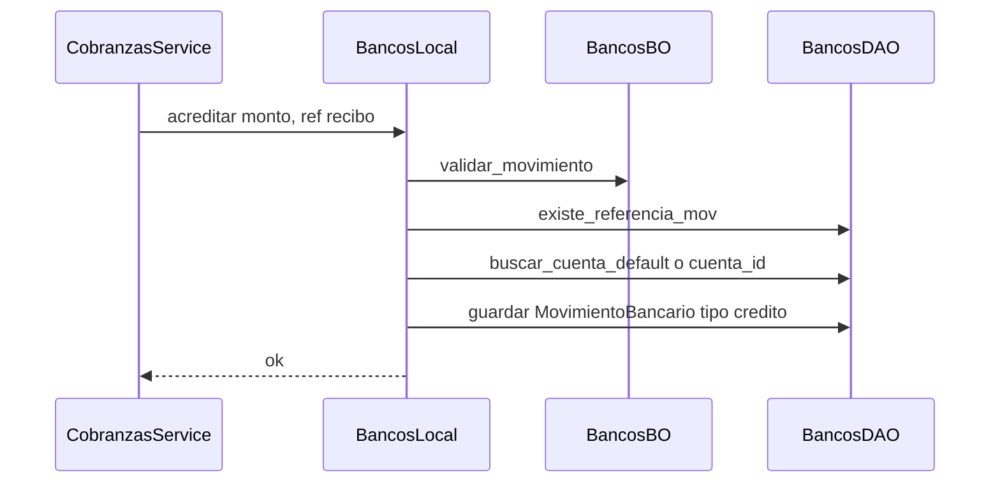
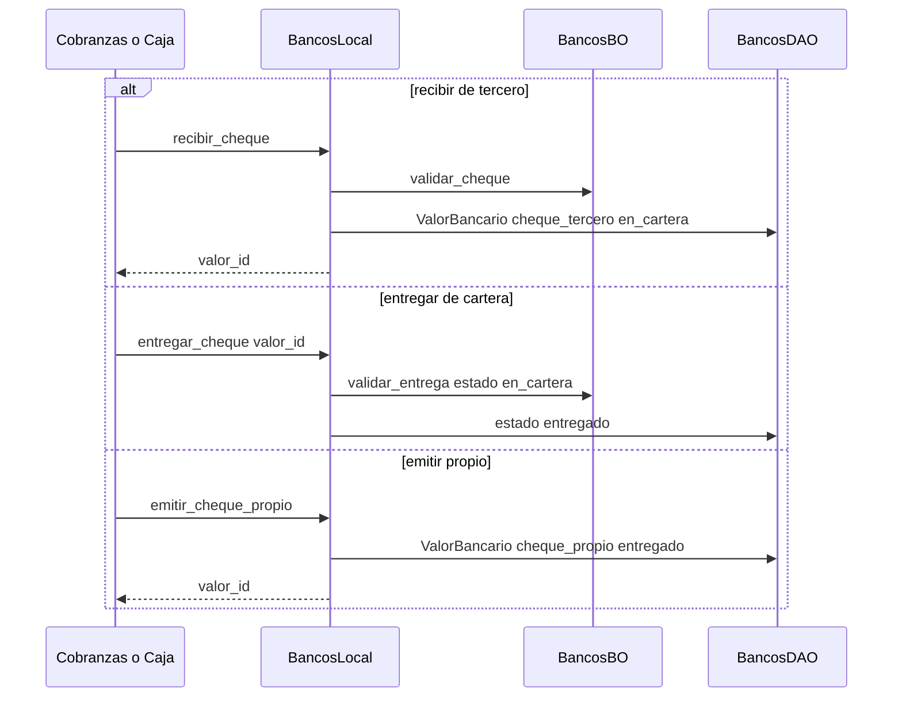
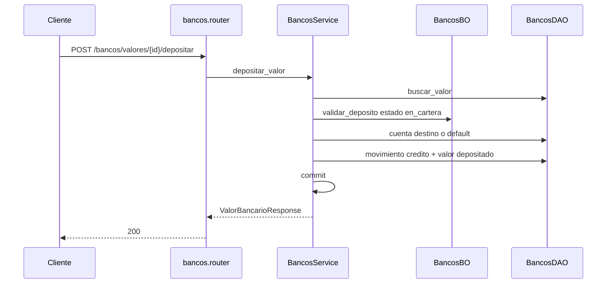

# bancos — acreditar, cartera de cheques y depositar

Fuente: `app/modulos/bancos/` · Flujos: `ContratoBancos` (cobranzas/caja/pagos) y `POST /api/v1/bancos/valores/{id}/depositar`.
Actualizado: 2026-08-29.

## Acreditar (contrato, misma TX que cobranzas)

## Cartera de cheques (contrato)

Sin commit: lo hace el service orquestador.

## Depositar valor en cartera

## Otros endpoints

| Método | Ruta | operation_id |
|--------|------|----------------|
| GET/POST | `/bancos/cuentas` | listar / crear cuenta |
| GET | `/bancos/movimientos` | `listar_movimientos_bancarios` |
| GET/POST | `/bancos/valores` | listar (`estado`, `tipo`, `q`) / crear valor en cartera |
| POST | `/bancos/valores/{id}/depositar` | `depositar_valor_bancario` |
| POST | `/bancos/valores/{id}/entregar` | `entregar_valor_bancario` |

`ContratoBancos`: `acreditar`, `debitar`, `recibir_cheque`, `entregar_cheque`, `emitir_cheque_propio`. Usado por **cobranzas**, **caja** y **pagos**.
