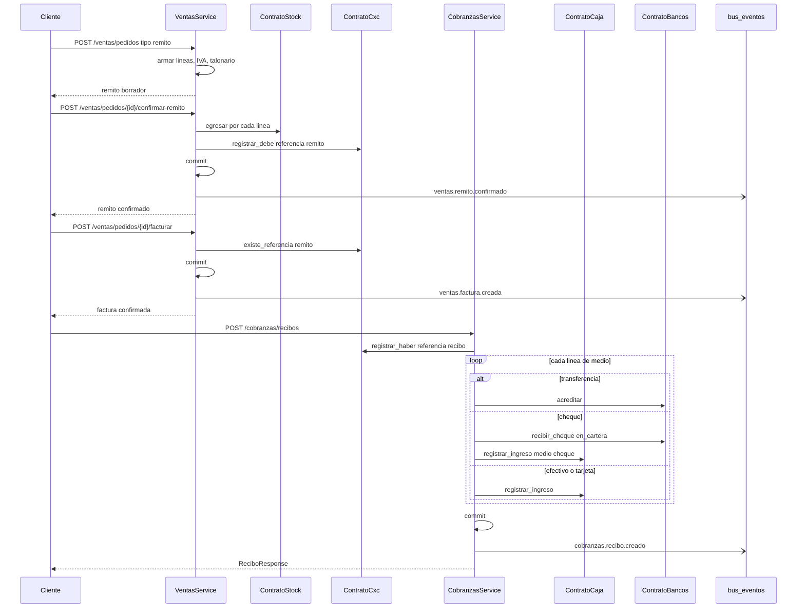

# Cadena venta → cobro → tesorería

Fuente: `ventas`, `cxc`, `cobranzas`, `caja`, `bancos`, `stock`, `parametros`.
Actualizado: 2026-08-29.

Flujo de punta a punta de un remito de venta hasta el impacto en caja, banco o cartera de cheques. Cada paso HTTP es un caso de uso con su propia transacción, salvo el impacto interno vía contrato (misma TX que el service llamador).

Si el remito ya imputó CxC, facturar no duplica el debe. Un recibo puede mezclar medios (`mixto`) y dejar saldo a cuenta si las imputaciones no cubren el monto.

El espejo de compras es [compras.md](compras.md) + [cxp.md](cxp.md): pedido (sin stock) → remito (ingreso) → factura (debe al proveedor, sin duplicar stock).
