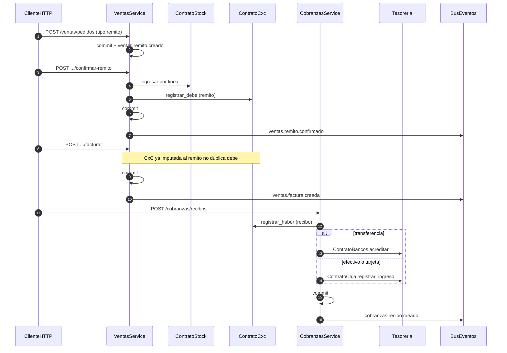

# Cadena extremo a extremo — remito → factura → recibo

Orquesta ventas, stock, CxC, cobranzas y tesorería. Cada service hace **su** commit; los contratos solo hacen flush.

Espejo de compras: confirmar remito/factura de compra ingresa stock y, si es `factura_compra`, registra debe en CxP (`compras.{tipo}.confirmado`).
