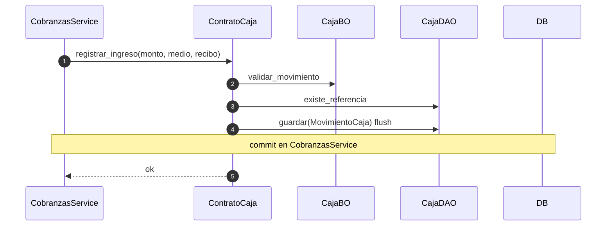

# caja — ingreso vía contrato (desde cobranzas)

Prefijo: `/api/v1/caja`. Módulo HTTP: `compras`.
Fuentes: `app/modulos/caja/{router,service,bo,dao,contrato}.py`.

## Contrato: registrar_ingreso (recibo efectivo/tarjeta)

## POST /caja/movimientos (`operation_id`: `crear_movimiento_caja`)

Alta manual: `CajaService.crear_movimiento` → BO → DAO (`referencia_tipo=manual`) → **commit propio**.

Expone `ContratoCaja` (`registrar_ingreso`, `registrar_egreso`). Sin eventos.
