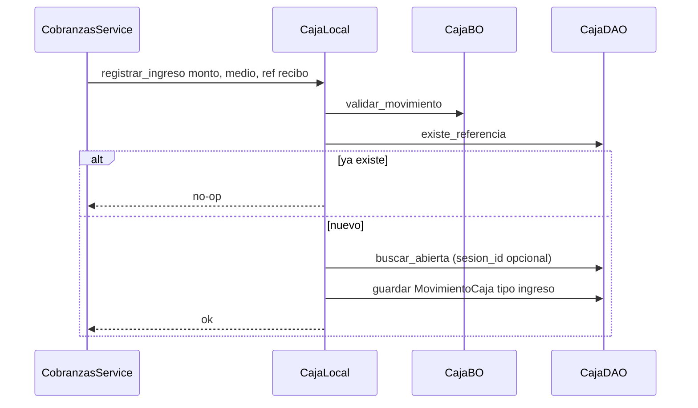
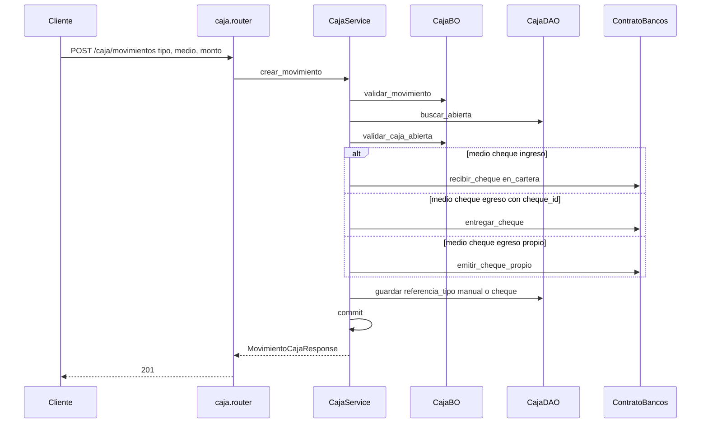
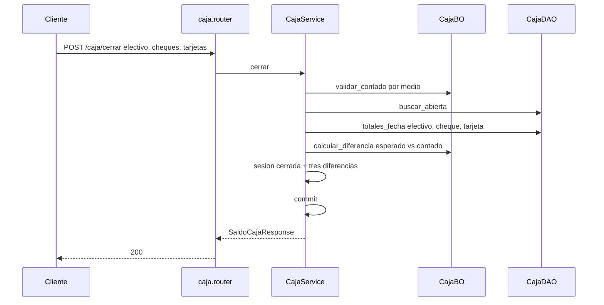

# caja — ingreso y cierre

Fuente: `app/modulos/caja/` · Flujos: contrato `registrar_ingreso` (cobranzas), `POST /api/v1/caja/movimientos` y `POST /api/v1/caja/cerrar`.
Actualizado: 2026-09-26.

El contrato es idempotente por referencia y **no commitea**. El alta HTTP exige caja abierta ese día. El cierre compara esperado vs contado en efectivo, cheques y tarjetas. Egreso en efectivo no puede superar el esperado del día; egreso exige concepto.

## Movimiento manual HTTP (incluye cheques)

## Cerrar caja (efectivo / cheque / tarjeta)

`POST /caja/abrir` con fondo inicial > 0 genera un ingreso efectivo `referencia_tipo=apertura`.

## Otros endpoints

| Método | Ruta | operation_id |
|--------|------|----------------|
| GET | `/caja/movimientos` | `listar_movimientos_caja` (`fecha`) |
| GET | `/caja/saldo` | `saldo_caja` (esperado por medio; `fecha`) |
| POST | `/caja/abrir` | `abrir_caja` |
| POST | `/caja/cerrar` | `cerrar_caja` |
| POST | `/caja/movimientos` | `crear_movimiento_caja` |

Permiso: módulo `compras`.

`ContratoCaja`: `registrar_ingreso`, `registrar_egreso`. Usado por **cobranzas** y **pagos**.
