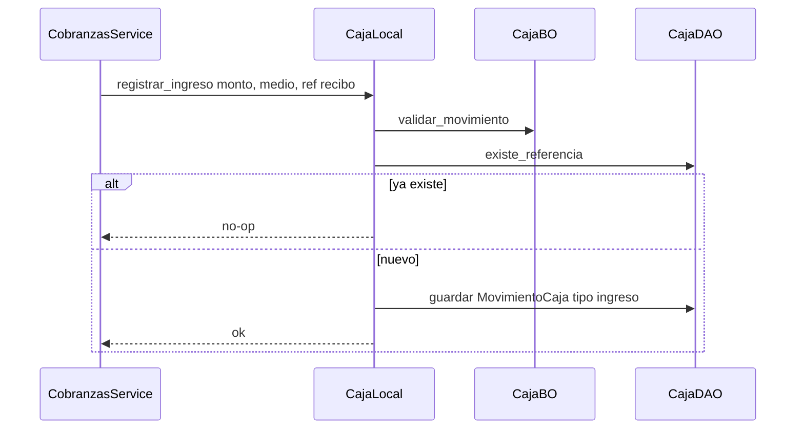
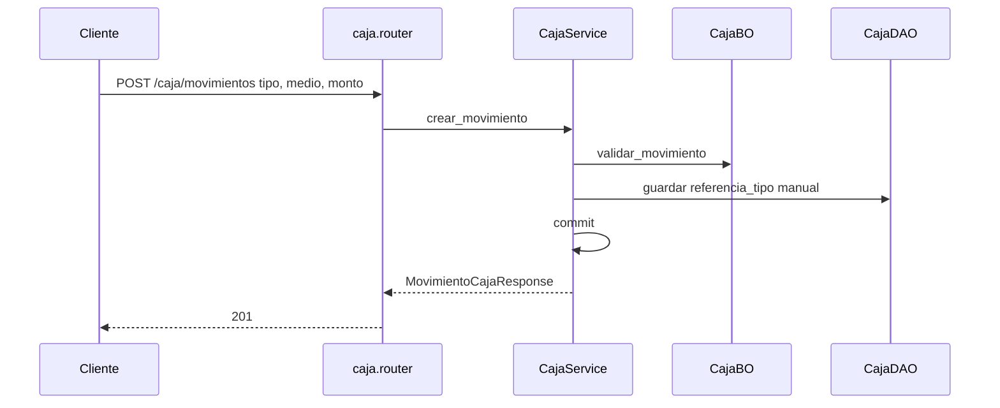

# caja — ingreso

Fuente: `app/modulos/caja/` · Flujos: contrato `registrar_ingreso` (cobranzas) y `POST /api/v1/caja/movimientos` (manual).
Actualizado: 2026-08-26.

El contrato es idempotente por referencia y **no commitea**. El alta HTTP es movimiento `manual`.

## Movimiento manual HTTP

## Otros endpoints

| Método | Ruta | operation_id |
|--------|------|----------------|
| GET | `/caja/movimientos` | `listar_movimientos_caja` |
| GET | `/caja/saldo` | `saldo_caja` |

`ContratoCaja`: `registrar_ingreso`, `registrar_egreso`. Usado por **cobranzas**.
