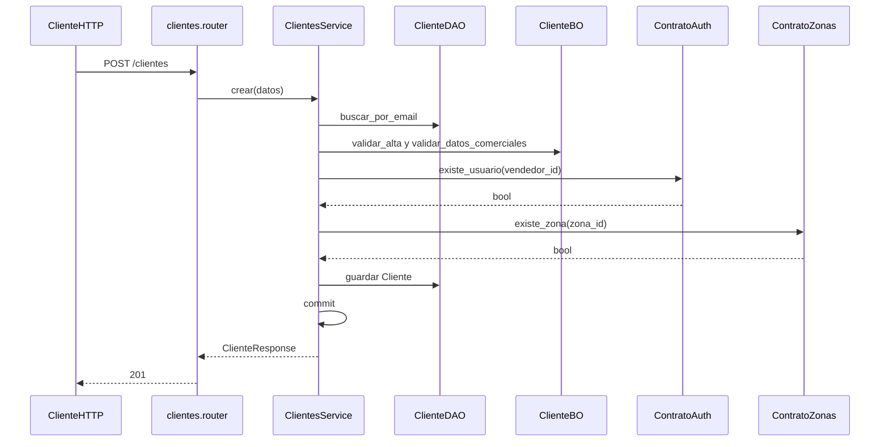

# clientes — alta

Fuente: `app/modulos/clientes/` · Flujo principal: `POST /api/v1/clientes`.
Actualizado: 2026-08-27.

Valida email único, datos comerciales, vendedor (auth) y zona (IDs débiles).

## Otros endpoints

| Método | Ruta | operation_id |
|--------|------|----------------|
| GET | `/clientes` | `listar_clientes` (paginado) |
| GET | `/clientes/{id}` | `obtener_cliente` |
| PUT | `/clientes/{id}` | `actualizar_cliente` |
| PATCH | `/clientes/{id}` | `desactivar_cliente` |

## Contrato público

`ContratoClientes`: `existe_cliente`, `contar_activos`, `nombres_por_ids`. Usado por **ventas**, **cxc**, **cobranzas**, **reporteria**.
