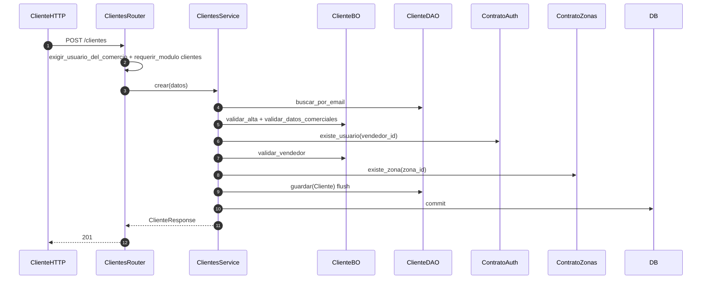

# clientes — alta de cliente

Prefijo: `/api/v1/clientes`. Módulo HTTP: `clientes`.
Fuentes: `app/modulos/clientes/{router,service,bo,dao,contrato}.py`.

## POST /clientes (`operation_id`: `crear_cliente`)

Usa `ContratoAuth` y `ContratoZonas`. Expone `ContratoClientes` (`existe_cliente`, `contar_activos`).
