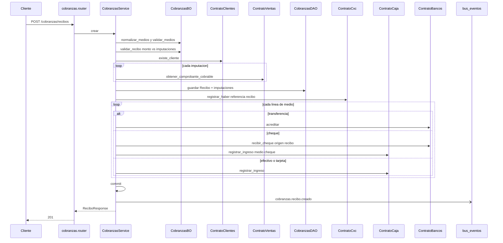

# cobranzas — crear recibo

Fuente: `app/modulos/cobranzas/` · Flujo principal: `POST /api/v1/cobranzas/recibos`.
Actualizado: 2026-08-30.

Valida imputaciones contra comprobantes cobrables (remito/factura), registra **un** haber en CxC (referencia `recibo`) e impacta tesorería **por cada línea de medio**.

Medios: un `medio` + `cheque` opcional, o `medios[]` (efectivo, transferencia, tarjeta, cheque). Si hay más de una línea, el recibo queda `mixto`. Hasta 3 cheques. La suma de medios debe igualar el monto.

Imputaciones opcionales: la suma no puede superar el monto. Si suma menos, el resto queda **a cuenta** (anticipo). Si no hay imputaciones, todo el haber es a cuenta.

## Otros endpoints

| Método | Ruta | operation_id |
|--------|------|----------------|
| GET | `/cobranzas/recibos` | `listar_recibos` |
| GET | `/cobranzas/recibos/{id}` | `obtener_recibo` |

No hay `contrato.py` de cobranzas: el módulo orquesta a otros.
