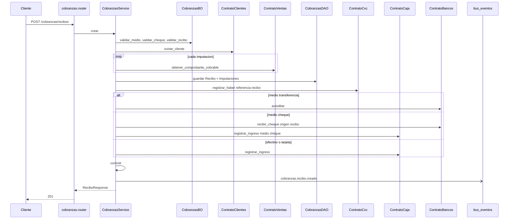

# cobranzas — crear recibo

Fuente: `app/modulos/cobranzas/` · Flujo principal: `POST /api/v1/cobranzas/recibos`.
Actualizado: 2026-08-27.

Valida imputaciones contra comprobantes cobrables (remito/factura), registra haber en CxC e impacta tesorería según medio (efectivo/tarjeta → caja; transferencia → banco; cheque → cartera + caja).

## Otros endpoints

| Método | Ruta | operation_id |
|--------|------|----------------|
| GET | `/cobranzas/recibos` | `listar_recibos` |
| GET | `/cobranzas/recibos/{id}` | `obtener_recibo` |

No hay `contrato.py` de cobranzas: el módulo orquesta a otros.
