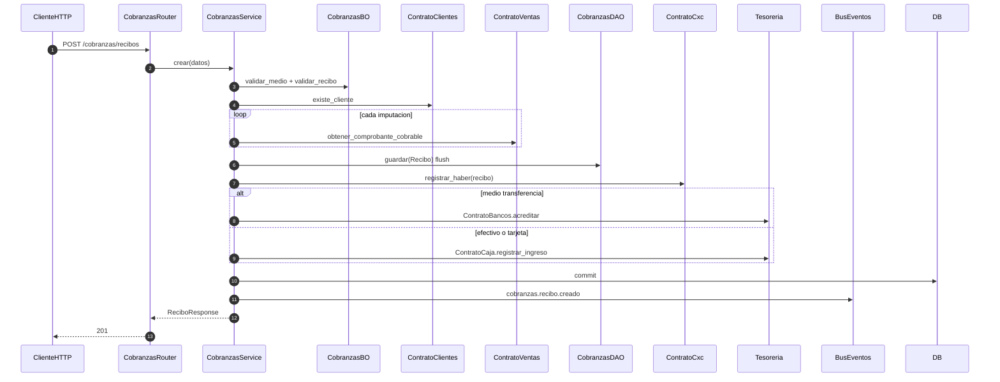

# cobranzas — crear recibo (CxC + tesorería)

Prefijo: `/api/v1/cobranzas`.
Fuentes: `app/modulos/cobranzas/{router,service,bo,dao}.py`.

## POST /cobranzas/recibos (`operation_id`: `crear_recibo`)

Usa: `ContratoClientes`, `ContratoVentas`, `ContratoCxc`, `ContratoCaja`, `ContratoBancos`.
No expone contrato. Publica `cobranzas.recibo.creado`.
