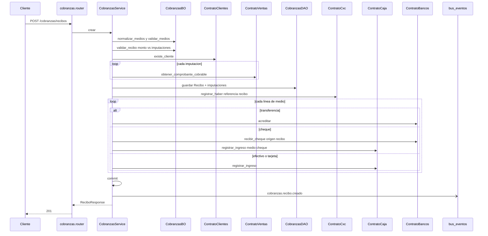

# cobranzas — crear recibo

Fuente: `app/modulos/cobranzas/` · Flujo principal: `POST /api/v1/cobranzas/recibos`.
Actualizado: 2026-08-28.

Valida imputaciones contra comprobantes cobrables (remito/factura), registra **un** haber en CxC por el monto del recibo e impacta tesorería por cada línea de medio. Las imputaciones pueden ser menores al monto (a cuenta) o vacías (anticipo); no pueden superarlo.

Medios: un solo `medio` o lista `medios` (efectivo, tarjeta, transferencia, cheque; máximo 3 cheques). Si hay más de una línea, el recibo persiste `medio=mixto`. Cada línea de tesorería usa referencia `recibo_id` o `recibo_id:índice` para idempotencia.

La UI suele imputar deudas de más antigua a más reciente; el API aplica las imputaciones que llegan en el request (FIFO es decisión del cliente HTTP).

## Otros endpoints

| Método | Ruta | operation_id |
|--------|------|----------------|
| GET | `/cobranzas/recibos` | `listar_recibos` |
| GET | `/cobranzas/recibos/{id}` | `obtener_recibo` |

No hay `contrato.py` de cobranzas: el módulo orquesta a otros.
