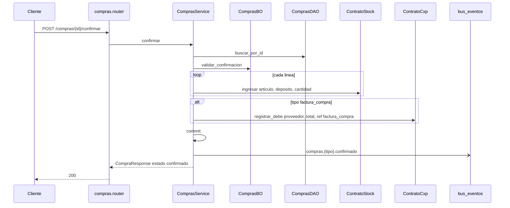

# compras — confirmar compra

Fuente: `app/modulos/compras/` · Flujo principal: `POST /api/v1/compras/{id}/confirmar`.
Actualizado: 2026-08-26.

Ingreso de stock al depósito. Si el tipo es `factura_compra`, imputa debe en CxP. Misma TX + evento `compras.{tipo}.confirmado`.

## Crear y facturar remito

- `POST /compras`: valida proveedor, depósito, líneas (costo de lista o `precio_unitario`), IVA de parámetros, estado `borrador`.
- `POST /compras/{id}/facturar`: remito confirmado → `factura_compra` + `registrar_debe` CxP + evento `compras.factura_compra.creada`.

## Otros endpoints

| Método | Ruta | operation_id |
|--------|------|----------------|
| GET | `/compras` | `listar_compras` |
| GET | `/compras/{id}` | `obtener_compra` |
| POST | `/compras` | `crear_compra` |
| POST | `/compras/{id}/facturar` | `facturar_remito_compra` |

No hay `contrato.py` de compras.
