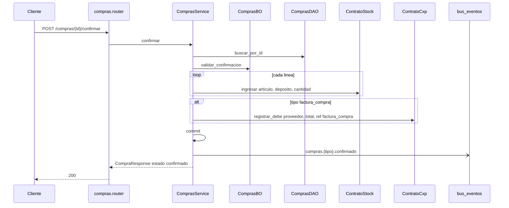
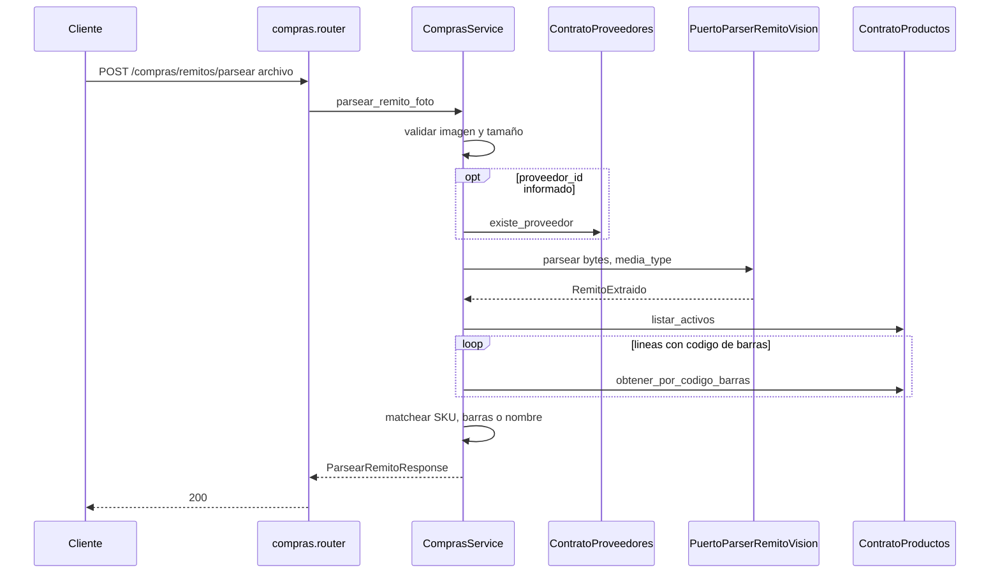

# compras — confirmar compra

Fuente: `app/modulos/compras/` · Flujo principal: `POST /api/v1/compras/{id}/confirmar`.
Actualizado: 2026-08-28.

Ingreso de stock al depósito. Si el tipo es `factura_compra`, imputa debe en CxP. Misma TX + evento `compras.{tipo}.confirmado`.

## Parsear remito desde foto

`POST /compras/remitos/parsear` (multipart: JPEG/PNG/WebP). **Solo lectura**: extrae líneas con visión (puerto `PuertoParserRemitoVision`) y las matchea al catálogo. No crea la compra; el operador confirma con `POST /compras`.

Adaptador: `mock`, `anthropic` o `auto` (`VENTAS360_REMITO_PARSE_MODO`). En `auto`, Haiku si hay API key; si no, mock.

## Crear y facturar remito

- `POST /compras`: valida proveedor, depósito, líneas (costo de lista o `precio_unitario`), IVA de parámetros, estado `borrador`.
- `POST /compras/{id}/facturar`: remito confirmado → `factura_compra` + `registrar_debe` CxP + evento `compras.factura_compra.creada`.

## Otros endpoints

| Método | Ruta | operation_id |
|--------|------|----------------|
| GET | `/compras` | `listar_compras` |
| GET | `/compras/{id}` | `obtener_compra` |
| POST | `/compras` | `crear_compra` |
| POST | `/compras/remitos/parsear` | `parsear_remito_foto` |
| POST | `/compras/{id}/confirmar` | `confirmar_compra` |
| POST | `/compras/{id}/facturar` | `facturar_remito_compra` |

No hay `contrato.py` de compras. El parser de visión vive en `puerto.py` + `adaptadores/`.
