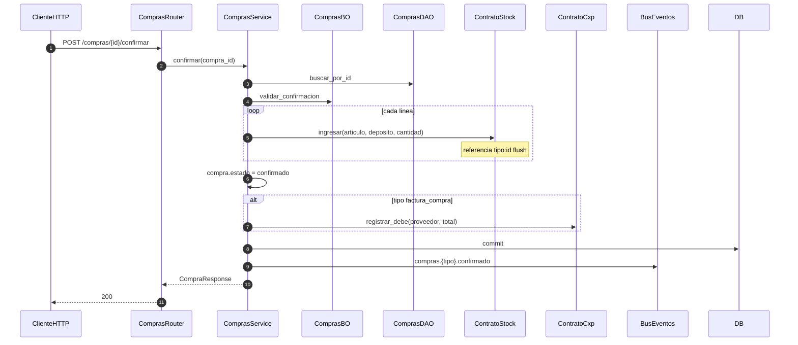

# compras — confirmar compra (stock + CxP)

Prefijo: `/api/v1/compras`.
Fuentes: `app/modulos/compras/{router,service,bo,dao}.py`.

## POST /compras/{id}/confirmar (`operation_id`: `confirmar_compra`)

## Otros flujos

| operation_id | Resumen |
|--------------|---------|
| `crear_compra` | Valida proveedor, arma líneas, IVA, estado borrador, commit |
| `facturar_remito_compra` | Remito confirmado → factura_compra + debe CxP; evento `compras.factura_compra.creada` |

Usa: `ContratoProveedores`, `ContratoProductos`, `ContratoStock`, `ContratoParametros`, `ContratoCxp`.
No expone contrato.
