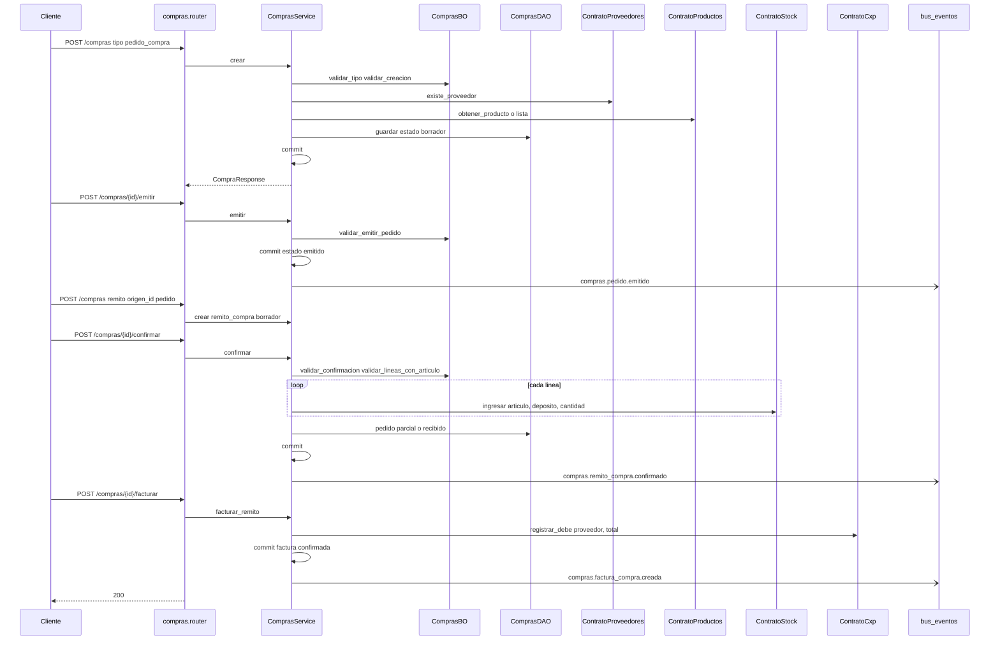
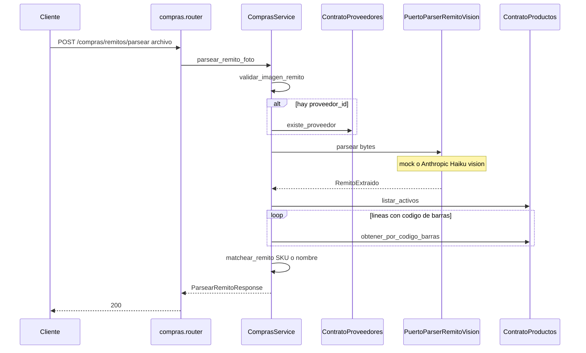

# compras — ciclo pedido → remito → factura

Fuente: `app/modulos/compras/` · Permiso: módulo `compras` · Prefijo HTTP: `/api/v1/compras`.
Actualizado: 2026-08-31.

El módulo registra **cómo el comercio compra**. Un comprobante es un `pedido_compra`, un `remito_compra` o una `factura_compra`. El catálogo (SKU propio) vive en **productos**; la lista del proveedor vive en **proveedores**. Compras los usa, no los crea.

No hay `contrato.py`: otros módulos no llaman a compras. Stock, CxP, productos y proveedores se consumen por contrato.

## Qué hace

| Acción | Efecto |
|--------|--------|
| Pedido de compra (OC) | Compromiso con el proveedor. **No** mueve stock ni CxP. |
| Emitir pedido | `borrador` → `emitido`. Habilita recepción. |
| Remito (confirmar) | `stock.ingresar` al depósito. Si tiene `origen_id` de pedido, el pedido pasa a `parcial` o `recibido`. |
| Factura directa (sin origen) | Ingresa stock **y** imputa debe en CxP. |
| Facturar remito | Crea `factura_compra` confirmada e imputa CxP. **No** vuelve a ingresar stock. |
| Parsear foto de remito | Extrae líneas (IA o mock). No persiste; el cliente crea el remito después. |

Recepción parcial: varios remitos contra el mismo pedido. `cantidad_pedida` / `cantidad_recibida` se calculan en el response del pedido (solo remitos `confirmado` o `facturado`).

## Qué no hace

Pagos a proveedor (`registrar_haber` CxP), devoluciones, AFIP, multi-moneda, landed cost, aprobaciones de OC, ni alta masiva de artículos. Importar Excel es de **proveedores**, no de compras.

## Tipos, estados y origen

```
pedido_compra:   borrador → emitido → parcial → recibido
remito_compra:   borrador → confirmado → facturado
factura_compra:  borrador → confirmado
```

`origen_id` (ID débil, mismo módulo):

- remito ← pedido (`pedido_compra` en `emitido` o `parcial`)
- factura ← remito (`remito_compra` confirmado), vía `POST /compras/{id}/facturar`

Un remito o una factura también se pueden crear **sin** origen.

`deposito_id` es obligatorio para remito y factura. El pedido puede ir sin depósito.

## Líneas: catálogo vs lista

Tres códigos distintos: **SKU del comercio**, **código de proveedor**, **código de barras**.

Cada línea lleva `producto_id` (artículo) y/o `codigo_proveedor` (ítem de lista). Al armar:

1. Si hay `producto_id` → nombre y costo del artículo. Si no mandan código de proveedor, se copia el del producto.
2. Si solo hay `codigo_proveedor` → se busca en la lista de ese proveedor. El `producto_id` queda vacío si el ítem no está dado de alta.
3. `precio_unitario` opcional; si falta, usa el costo de lista.

**Confirmar remito o factura directa** exige que todas las líneas tengan artículo de catálogo. Si un código sigue “solo en lista”, hay que darlo de alta (`POST /proveedores/{id}/listas/items/{item_id}/alta` con SKU propio) o vincularlo.

El pedido sí puede incluir códigos que todavía no están en el catálogo.

## Efectos al confirmar / facturar

| Tipo | Origen | Stock | CxP |
|------|--------|-------|-----|
| `pedido_compra` | — | no (ni al emitir) | no |
| `remito_compra` | pedido o ninguno | `ingresar` | no |
| `factura_compra` | ninguno | `ingresar` | `registrar_debe` |
| `factura_compra` | remito confirmado | no | `registrar_debe` |

IVA: `ContratoParametros.obtener_negocio()`. Neto, IVA y total se calculan al crear.

## Eventos

| Evento | Cuándo |
|--------|--------|
| `compras.pedido.emitido` | Emitir OC |
| `compras.remito_compra.confirmado` | Confirmar remito |
| `compras.factura_compra.confirmado` | Confirmar factura directa |
| `compras.factura_compra.creada` | Facturar remito |

## Flujo principal



## Endpoints

| Método | Ruta | operation_id | Qué hace |
|--------|------|----------------|----------|
| GET | `/compras` | `listar_compras` | Lista; query `tipo` opcional. En pedidos incluye `cantidad_pedida` / `cantidad_recibida`. |
| GET | `/compras/{id}` | `obtener_compra` | Detalle |
| POST | `/compras` | `crear_compra` | Borrador. Líneas con artículo y/o código de proveedor. `origen_id` opcional. |
| POST | `/compras/{id}/emitir` | `emitir_pedido_compra` | Solo `pedido_compra` en borrador |
| POST | `/compras/{id}/confirmar` | `confirmar_compra` | Remito o factura en borrador. Pedido: 422. |
| POST | `/compras/{id}/facturar` | `facturar_remito_compra` | Remito confirmado → factura + CxP |
| POST | `/compras/remitos/parsear` | `parsear_remito_foto` | JPEG/PNG/WebP. No persiste. |

Errores de negocio → HTTP **422** (`ReglaDeNegocioViolada`).

## Contratos que consume

- `ContratoProveedores`: `existe_proveedor`, `obtener_item`
- `ContratoProductos`: `obtener_producto`, `listar_activos`, `obtener_por_codigo_barras`
- `ContratoStock`: `ingresar`
- `ContratoCxp`: `registrar_debe`
- `ContratoParametros`: `obtener_negocio` (IVA)

## Parsear foto de remito

`POST /compras/remitos/parsear` (multipart JPEG/PNG/WebP). No persiste: el front crea el remito después.



`VENTAS360_REMITO_PARSE_MODO`: `mock`, `anthropic` o `auto` (Anthropic si hay API key).

Lista Excel, alta de SKU y vínculo ítem→artículo: ver [proveedores.md](proveedores.md).

## Web (`ventas360-web` · `/compras`)

Misma pantalla, cuatro pestañas (el diseño visual se actualiza aparte):

- **Pedidos de compra** — crear, emitir, recibir (abre remito con `origen_id`)
- **Remitos y facturas** — confirmar (stock) y facturar (CxP)
- **Proveedores** — alta y saldo CxP
- **Listas de precios** — import Excel (no crea catálogo) y dar de alta con SKU propio

Stock → Recepción de remitos confirma con el mismo `POST /compras/{id}/confirmar`.
