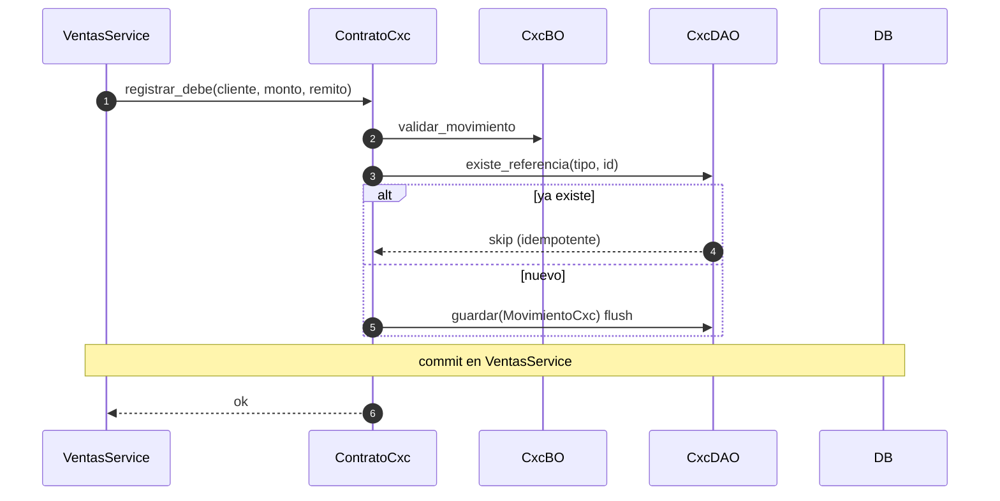

# cxc — debe vía contrato (desde ventas)

Prefijo HTTP: `/api/v1/cxc` (consultas + ajuste manual).
Fuentes: `app/modulos/cxc/{router,service,bo,dao,contrato}.py`.

La escritura típica **no** entra por HTTP: `VentasService` y `CobranzasService` llaman `ContratoCxc`. El commit queda en el service orquestador.

## Contrato: registrar_debe (confirmación de remito)

## POST /cxc/ajustes (`operation_id`: `registrar_ajuste_cxc`)

`CxcService.registrar_ajuste` → `existe_cliente` → `registrar_debe` o `registrar_haber` → **commit propio**.

Usa `ContratoClientes`. Expone `ContratoCxc`. Sin eventos.
