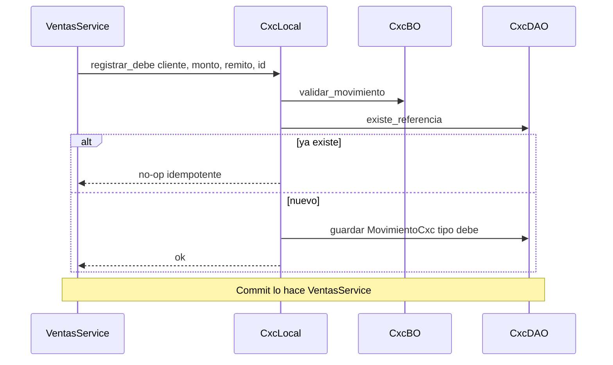
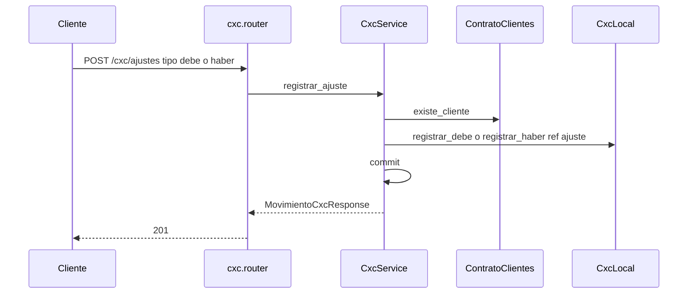

# cxc — registrar debe (contrato)

Fuente: `app/modulos/cxc/` · Flujo principal: `ContratoCxc.registrar_debe` (invocado por ventas al confirmar remito / confirmar factura).
Actualizado: 2026-09-24.

El HTTP de CxC es de consulta y ajustes manuales. El debe operativo lo escriben **ventas** y el haber **cobranzas**, sin commit en el contrato (idempotente por `referencia_tipo` + `referencia_id`).

No hay imputación FIFO dentro de CxC: el recibo registra **un** haber por el monto total; las imputaciones a remito/factura viven en **cobranzas**.

## Ajuste HTTP (`POST /cxc/ajustes`)

Ajustes: módulo `configuracion`. Consultas: módulo `cta_cte`.

## Otros endpoints

| Método | Ruta | operation_id |
|--------|------|----------------|
| GET | `/cxc/saldos` | `listar_saldos_cxc` |
| GET | `/cxc/clientes/{id}/saldo` | `obtener_saldo_cxc` |
| GET | `/cxc/clientes/{id}/estado-cuenta` | `estado_cuenta_cxc` |
| POST | `/cxc/ajustes` | `registrar_ajuste_cxc` |

Saldo = debe − haber (`CxcBO.calcular_saldo`). El listado de saldos incluye `fecha_debe_mas_antigua` (vencidos de reportería).

## Contrato público

`ContratoCxc`: `registrar_debe`, `registrar_haber`, `saldo_cliente`, `existe_referencia`. Usado por **ventas** y **cobranzas**. **reporteria** lee `CxcDAO.saldos_agrupados` en el mismo proceso (el contrato no expone ese agregado).
