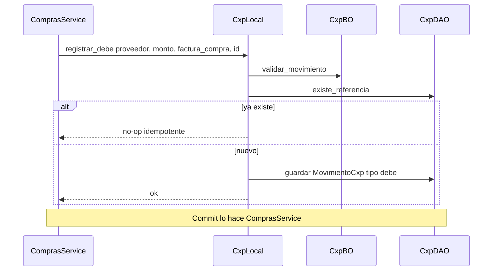
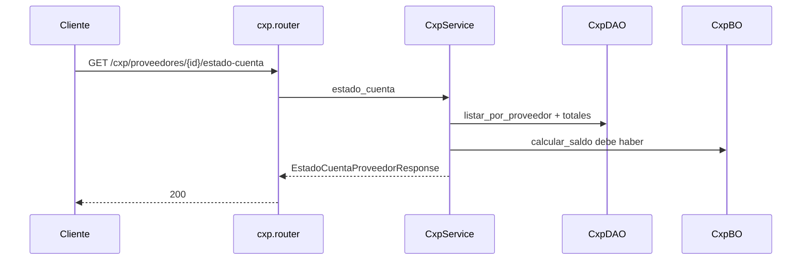

# cxp — registrar debe (contrato)

Fuente: `app/modulos/cxp/` · Flujo principal: `ContratoCxp.registrar_debe` (invocado por compras al confirmar/facturar).
Actualizado: 2026-08-26.

Sin endpoints de escritura HTTP: el debe lo escribe **compras**. El router solo consulta saldos y estado de cuenta. Idempotente por referencia; sin commit en el contrato.

## Consulta HTTP

## Endpoints

| Método | Ruta | operation_id |
|--------|------|----------------|
| GET | `/cxp/saldos` | `listar_saldos_cxp` |
| GET | `/cxp/proveedores/{id}` | `estado_cuenta_proveedor` |

`ContratoCxp` también expone `registrar_haber` y `saldo_proveedor` (aún sin orquestador HTTP de pagos a proveedores).
