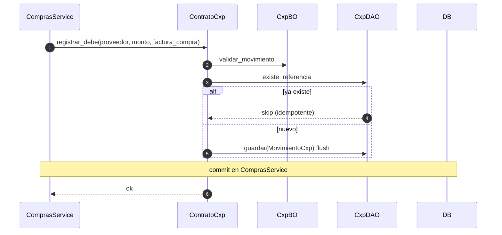

# cxp — debe vía contrato (desde compras)

Prefijo HTTP: `/api/v1/cxp` (solo lectura).
Fuentes: `app/modulos/cxp/{router,service,bo,dao,contrato}.py`.

La escritura **no** tiene endpoint HTTP: `ComprasService` llama `ContratoCxp.registrar_debe`. El commit queda en compras.

## Contrato: registrar_debe (factura de compra)

## GET /cxp/proveedores/{id} (`operation_id`: `estado_cuenta_proveedor`)

`CxpService.estado_cuenta` → `CxpDAO.listar_por_proveedor` + `totales_proveedor` → `CxpBO.calcular_saldo`.

Sin contratos entrantes. Expone `ContratoCxp`. Sin eventos.
