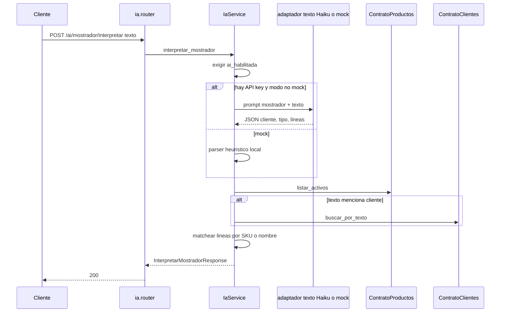
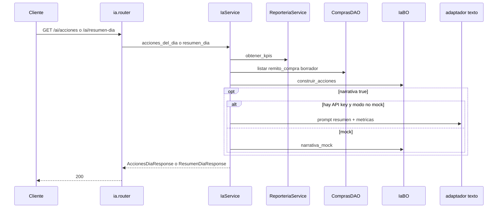

# ia — interpretar mostrador

Fuente: `app/modulos/ia/` · Flujo principal: `POST /api/v1/ai/mostrador/interpretar`.
Actualizado: 2026-08-28.

Convierte texto libre de mostrador en líneas de comprobante (cliente + productos). **No persiste ni publica eventos**: el operador confirma después en ventas. Si `VENTAS360_AI_HABILITADA` es falso, falla con `ReglaDeNegocioViolada`.

El adaptador de texto (Claude Haiku o mock) se elige según `VENTAS360_ANTHROPIC_API_KEY` y `VENTAS360_REMITO_PARSE_MODO`. Matching de padrón vía contratos; no hay `contrato.py` propio.

## Acciones y resumen del día

`GET /ai/acciones` y `GET /ai/resumen-dia` (módulo web `inicio`) leen KPIs y remitos de compra en borrador, y el BO arma la cola priorizada (`cobrar_cxc`, `facturar_remito`, `reponer_stock`, etc.). El resumen opcional pide una narrativa al mismo adaptador de texto.

Hoy IA llama `ReporteriaService` y `ComprasDAO` en el mismo proceso (reporteria y compras no exponen esos agregados por contrato).

## Webhook n8n (`GET /ai/webhook/resumen-dia`)

Sin JWT. Autentica con header `X-Ventas360-Webhook-Secret` y fija el tenant con `X-Tenant-Slug`. Luego reutiliza `resumen_dia`.

## Otros endpoints

| Método | Ruta | operation_id |
|--------|------|----------------|
| POST | `/ai/mostrador/interpretar` | `interpretar_mostrador` |
| GET | `/ai/acciones` | `acciones_del_dia` |
| GET | `/ai/resumen-dia` | `resumen_dia` |
| GET | `/ai/webhook/resumen-dia` | `webhook_resumen_dia_n8n` |
