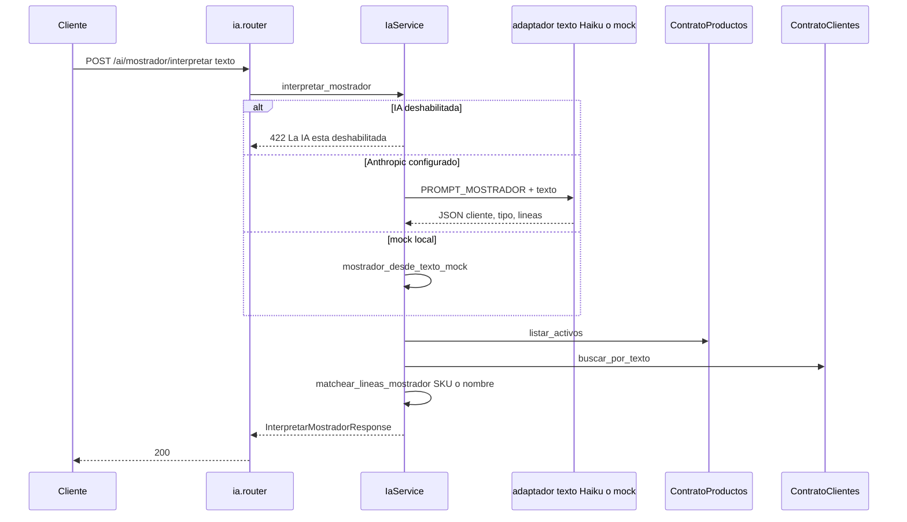
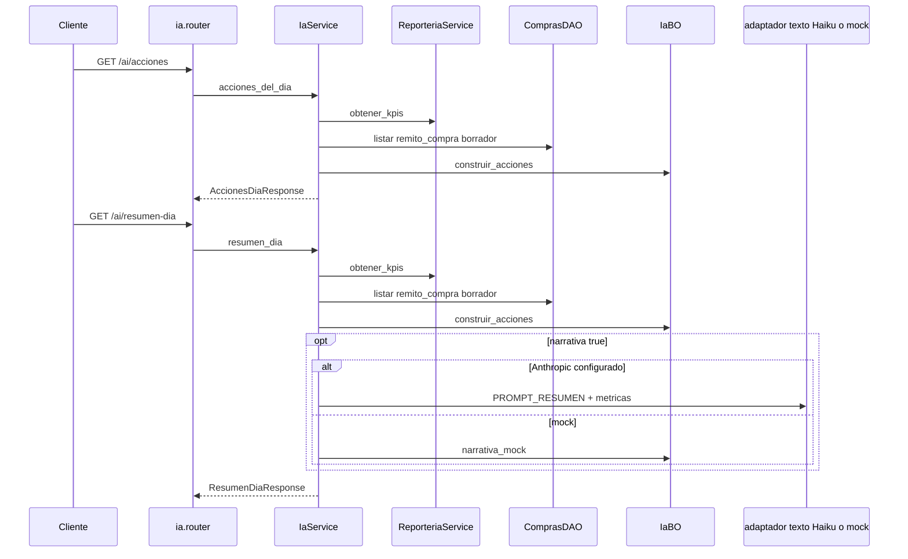
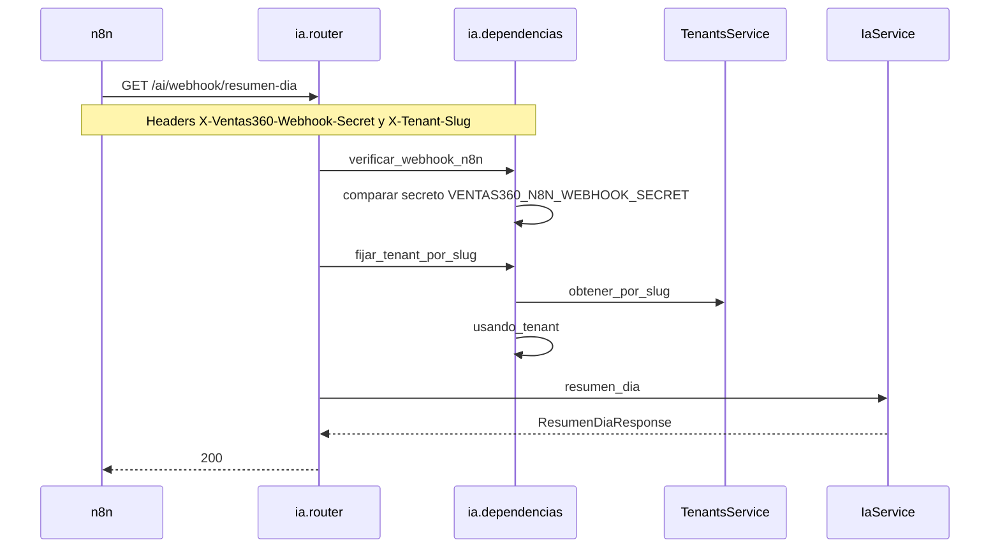

# ia — mostrador, acciones del día y resumen

Fuente: `app/modulos/ia/` · Flujo principal: `POST /api/v1/ai/mostrador/interpretar`.
Actualizado: 2026-08-29.

No persiste ni publica eventos. Interpreta texto de mostrador (Haiku o mock), matchea cliente y artículos, y arma sugerencias del día a partir de KPIs. El webhook de n8n lee el mismo resumen **sin JWT**: secreto de header + slug de tenant.

Prefijo HTTP: `/api/v1/ai` (inglés, el resto de la API usa nombres en español). Requiere `VENTAS360_AI_HABILITADA` para el mostrador.

## Interpretar mostrador

Permiso: módulo `mostrador`. No crea el comprobante: la UI arma el POST a ventas con el DTO devuelto.

## Acciones y resumen del día

Permiso: módulo `inicio`. `acciones_del_dia` no llama al LLM. `resumen_dia` opcionalmente pide narrativa a Haiku.

Hoy `IaService` lee `ReporteriaService` y `ComprasDAO` en el mismo proceso (no hay `contrato.py` de IA ni de compras para este agregado). El diseño de capas pide contratos; el diagrama refleja el código actual.

## Webhook n8n (sin JWT)

## Endpoints

| Método | Ruta | operation_id | Auth |
|--------|------|----------------|------|
| POST | `/ai/mostrador/interpretar` | `interpretar_mostrador` | JWT + módulo `mostrador` |
| GET | `/ai/acciones` | `acciones_del_dia` | JWT + módulo `inicio` |
| GET | `/ai/resumen-dia` | `resumen_dia` | JWT + módulo `inicio` |
| GET | `/ai/webhook/resumen-dia` | `webhook_resumen_dia_n8n` | secreto + slug (sin JWT) |

No hay `contrato.py`. Consumidores internos: **productos**, **clientes**, **reporteria**, **compras** (DAO), **tenants**.
