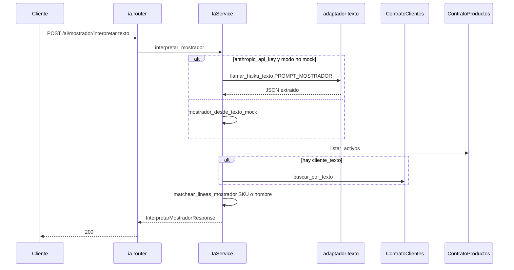
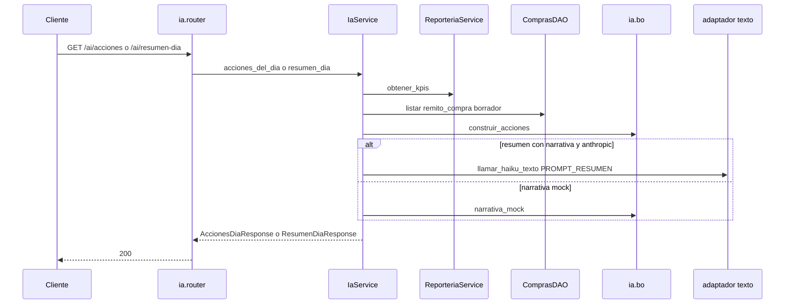
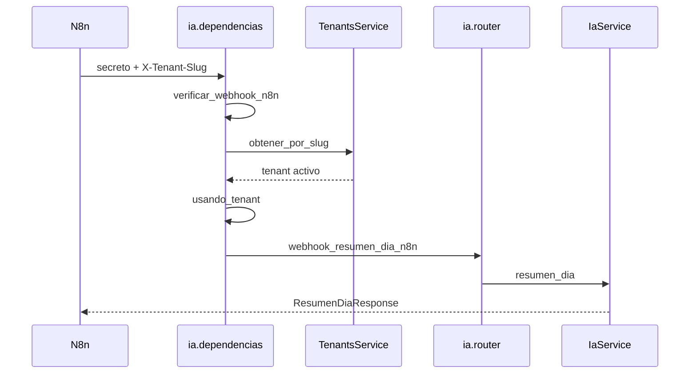

# ia — interpretar mostrador y resumen del día

Fuente: `app/modulos/ia/` · Prefijo HTTP: `/api/v1/ai`.
Actualizado: 2026-09-01.

El módulo no persiste ni publica eventos. Interpreta texto del mostrador, arma acciones del día y un resumen narrativo. El webhook de n8n replica el resumen **sin JWT** (secreto + slug de tenant).

No hay `contrato.py`. Hoy `IaService` consume `ReporteriaService` y `ComprasDAO` en el mismo proceso (sin contrato). Clientes y productos sí van por contrato.

## Interpretar mostrador (flujo principal)

`POST /ai/mostrador/interpretar` · JWT + módulo `mostrador`. Requiere `VENTAS360_AI_HABILITADA`.

No crea el comprobante: el front arma el POST a **ventas** con `cliente_id` y `producto_id` ya resueltos.

## Acciones y resumen del día

## Webhook n8n (sin JWT)

`GET /ai/webhook/resumen-dia` · headers `X-Ventas360-Webhook-Secret` y `X-Tenant-Slug`.

Si falta `VENTAS360_N8N_WEBHOOK_SECRET` o el secreto no coincide → `NoAutenticado`.

## Endpoints

| Método | Ruta | operation_id | Auth |
|--------|------|----------------|------|
| POST | `/ai/mostrador/interpretar` | `interpretar_mostrador` | JWT + módulo `mostrador` |
| GET | `/ai/acciones` | `acciones_del_dia` | JWT + módulo `inicio` |
| GET | `/ai/resumen-dia` | `resumen_dia` | JWT + módulo `inicio` |
| GET | `/ai/webhook/resumen-dia` | `webhook_resumen_dia_n8n` | secreto + slug |

Query `narrativa=true` (default) en los dos resúmenes.

## Contratos que consume

- `ContratoClientes.buscar_por_texto`
- `ContratoProductos.listar_activos`

Puerto de texto: `adaptadores/texto.py` (Haiku). Visión de remitos de compra está en [compras.md](compras.md), no acá.
