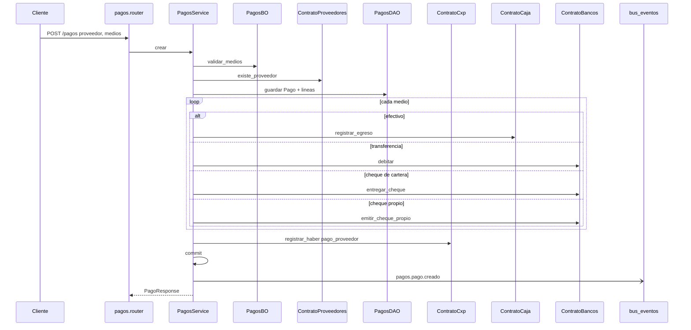

# pagos — pago a proveedor

Fuente: `app/modulos/pagos/` · Flujo principal: `POST /api/v1/pagos`.
Actualizado: 2026-08-28.

Espejo de cobranzas. Baja deuda (CxP haber) e impacta tesorería: efectivo → caja, transferencia → banco, cheque de cartera → `entregar_cheque`, cheque propio → `emitir_cheque_propio`.

La UI vive en Tesorería (`/tesoreria/pagos`). Este módulo API queda suelto.

## Endpoints

| Método | Ruta | operation_id |
|--------|------|----------------|
| GET | `/pagos` | `listar_pagos_proveedor` |
| GET | `/pagos/{id}` | `obtener_pago_proveedor` |
| POST | `/pagos` | `crear_pago_proveedor` |

Permiso: módulo `compras`. No hay `contrato.py`.
