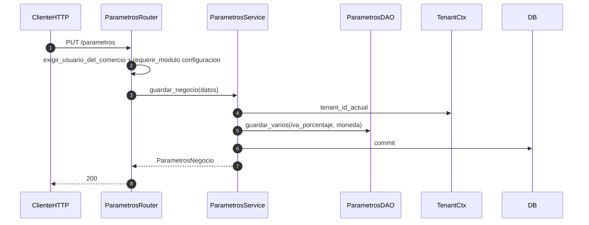

# parametros — guardar negocio y talonario

Prefijos: `/api/v1/parametros`, `/api/v1/preferencias` (sin prefix de router).
Fuentes: `app/modulos/parametros/{router,service,bo,dao,contrato}.py`.

## PUT /parametros (`operation_id`: `guardar_parametros`)

## Contrato: asignar_numero (usado por ventas)

`ParametrosLocal.asignar_numero(tipo_comprobante)` incrementa `Talonario.proximo_numero` (flush). El commit lo hace `VentasService`.

Sin contratos entrantes. Expone `ContratoParametros` (ventas, compras, reportería).
