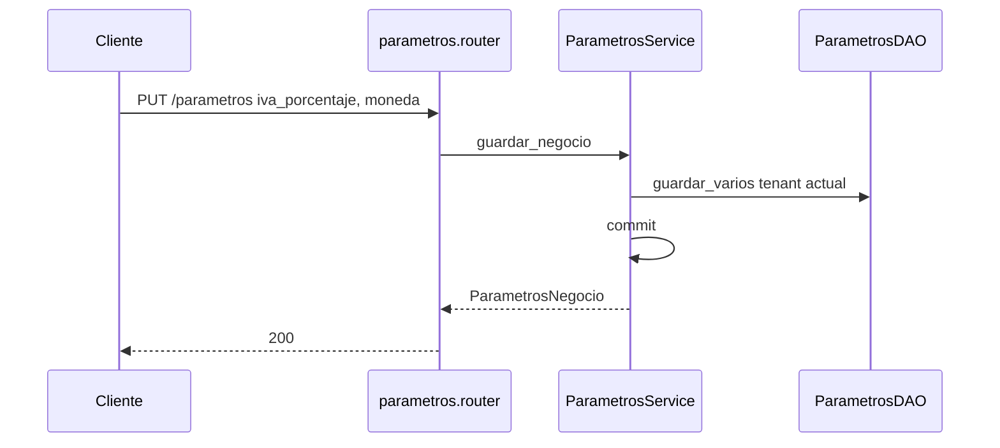
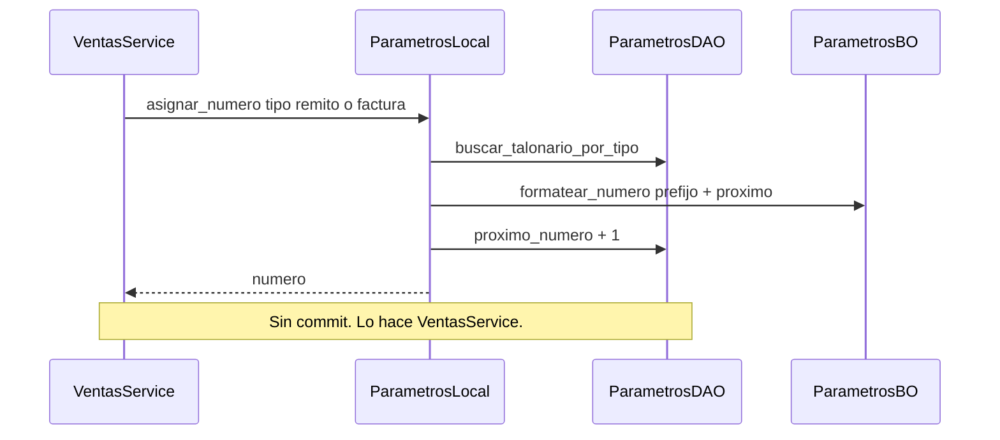

# parametros — guardar negocio

Fuente: `app/modulos/parametros/` · Flujo principal: `PUT /api/v1/parametros`.
Actualizado: 2026-08-29.

Claves por tenant (`iva_porcentaje`, `moneda`). El contrato `asignar_numero` lo usan **ventas** (talonario, sin commit propio).

## Asignar número de talonario (contrato)

## Otros endpoints

| Método | Ruta | operation_id |
|--------|------|----------------|
| GET | `/parametros` | `obtener_parametros` |
| GET/PUT | `/parametros/operativos` | sucursal y condiciones de pago |
| GET/PUT | `/parametros/afip` | identidad fiscal ARCA (emisor) |
| GET/PUT | `/parametros/talonarios` | `listar_talonarios` / `upsert_talonario` |
| GET/PUT | `/preferencias` | notificaciones |
| GET | `/parametria/categorias-producto` | `listar_categorias_producto` |

## Contrato público

`ContratoParametros`: `obtener_negocio`, `obtener_afip`, `asignar_numero`. Usado por **ventas**, **compras**, **reporteria**.
