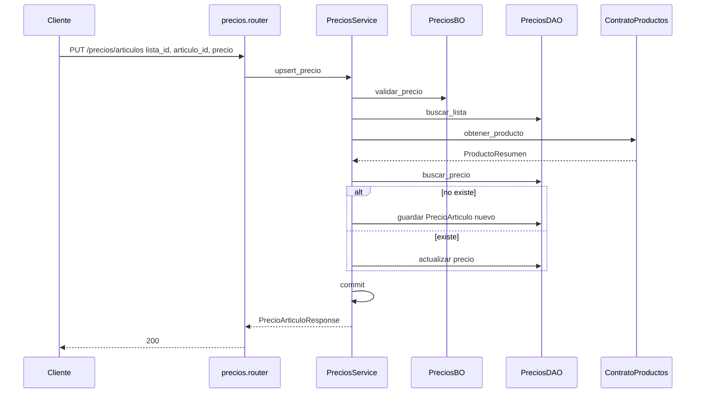

# precios — upsert artículo en lista

Fuente: `app/modulos/precios/` · Flujo principal: `PUT /api/v1/precios/articulos`.
Actualizado: 2026-08-26.

Crea o actualiza el precio de un artículo en una lista. La resolución de venta (lista default → catálogo) la consume **ventas** vía `ContratoPrecios.obtener_precio`.

## Resolución de precio (contrato / GET `/precios/resolver`)

Lista default con override → si no, `producto.precio` del catálogo. `cliente_id` está reservado (listas por cliente, Fase B).

## Otros endpoints

| Método | Ruta | operation_id |
|--------|------|----------------|
| GET/POST/PUT/PATCH | `/precios/listas` | CRUD listas |
| GET | `/precios/listas/{id}/articulos` | `listar_precios_lista` |
| GET | `/precios/resolver` | `resolver_precio` |

## Contrato público

`ContratoPrecios.obtener_precio(articulo_id, cliente_id)`. Usado por **ventas**.
