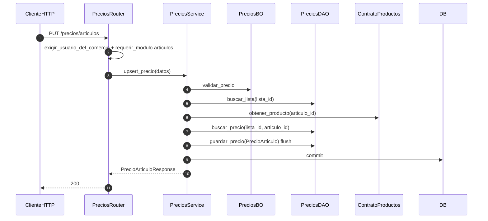

# precios — upsert de precio en lista

Prefijo: `/api/v1/precios`. Módulo HTTP: `articulos`.
Fuentes: `app/modulos/precios/{router,service,bo,dao,contrato}.py`.

## PUT /precios/articulos (`operation_id`: `upsert_precio_articulo`)

## GET /precios/resolver

Lista default → override de artículo (`origen: lista`) o `producto.precio` (`origen: catalogo`).

Usa `ContratoProductos`. Expone `ContratoPrecios` (usado por ventas al armar líneas).
