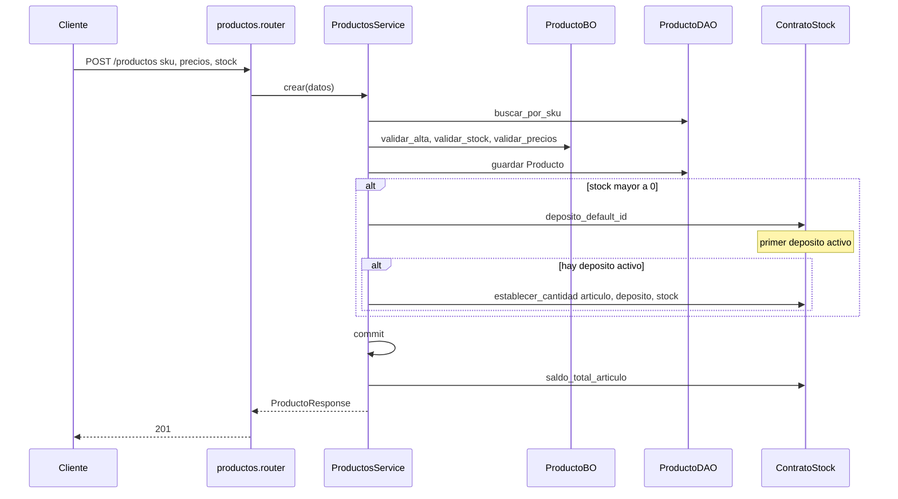

# productos — alta

Fuente: `app/modulos/productos/` · Flujo principal: `POST /api/v1/productos`.
Actualizado: 2026-09-24.

SKU único. Catálogo con marca, rubro, código de barras y código de proveedor. Si `stock > 0` y hay depósito default, sincroniza el saldo vía contrato (misma TX). Si no hay depósito, el stock queda solo en el campo plano del artículo.

Al actualizar, si cambia `stock` se vuelve a sincronizar el depósito default.

## Otros endpoints

| Método | Ruta | operation_id |
|--------|------|----------------|
| GET | `/productos` | `listar_productos` (paginado; stock via contrato) |
| GET | `/productos/{id}` | `obtener_producto` |
| POST | `/productos` | `crear_producto` |
| PUT | `/productos/{id}` | `actualizar_producto` |

## Contrato público

`ContratoProductos`: `obtener_producto`, `obtener_por_sku`, `obtener_por_codigo_barras`, `obtener_por_codigo_proveedor`, `buscar_por_texto`, `listar_activos`, `contar_activos`, `contar_bajo_stock`, `listar_bajo_stock`, `stock_total`, `establecer_stock`, `aplicar_costo_lista`, `crear_desde_proveedor`, `upsert_desde_lista`. Usado por **ventas**, **compras**, **precios**, **stock**, **proveedores**, **reporteria**, **ia**.
