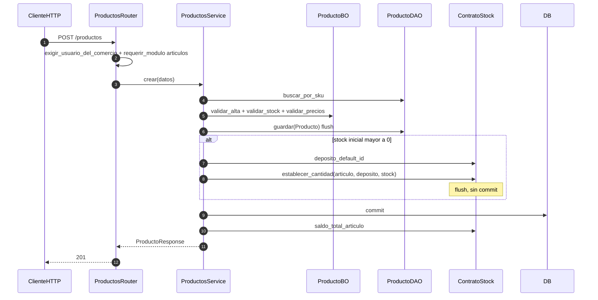

# productos — alta de producto + stock inicial

Prefijo: `/api/v1/productos`. Módulo HTTP: `articulos`.
Fuentes: `app/modulos/productos/{router,service,bo,dao,contrato}.py`.

## POST /productos (`operation_id`: `crear_producto`)

Usa `ContratoStock`. Expone `ContratoProductos` (`obtener_producto`, `obtener_por_sku`, `upsert_desde_lista`, `contar_activos`).
