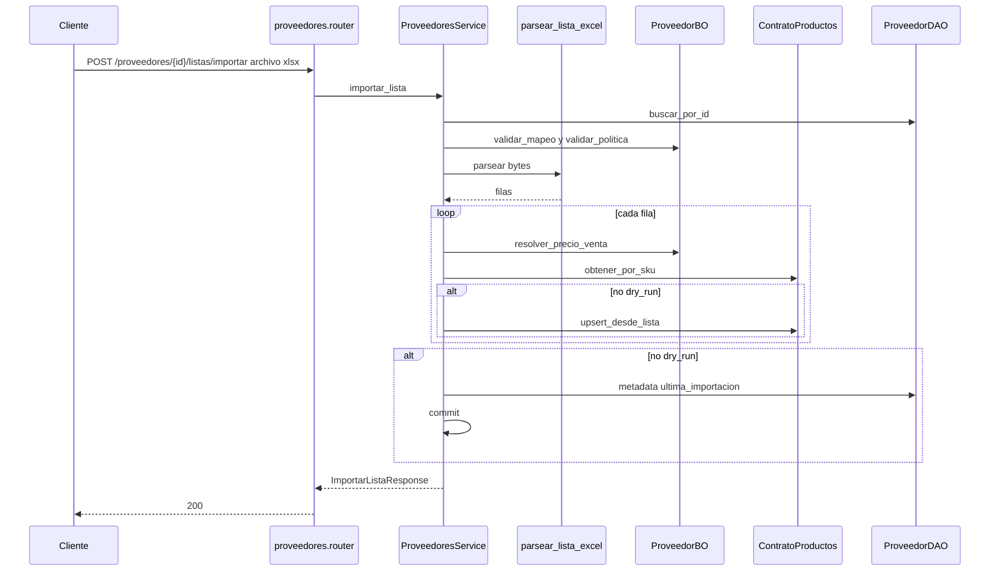

# proveedores — importar lista Excel

Fuente: `app/modulos/proveedores/` · Flujo principal: `POST /api/v1/proveedores/{id}/listas/importar`.
Actualizado: 2026-08-26.

Parsea `.xlsx`, resuelve precio de venta según política y hace upsert de artículos vía `ContratoProductos` (misma TX). `dry_run=true` no persiste.

## Otros endpoints

| Método | Ruta | operation_id |
|--------|------|----------------|
| GET | `/proveedores` | `listar_proveedores` |
| GET | `/proveedores/{id}` | `obtener_proveedor` |
| POST | `/proveedores` | `crear_proveedor` |
| PUT | `/proveedores/{id}` | `actualizar_proveedor` |
| PATCH | `/proveedores/{id}` | `desactivar_proveedor` |

## Contrato público

`ContratoProveedores.existe_proveedor`. Usado por **compras**.
