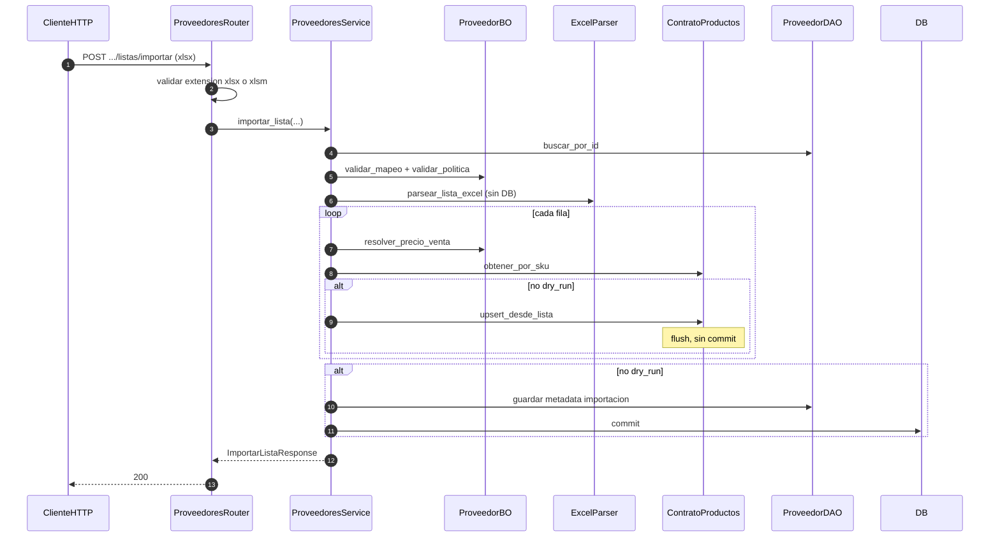

# proveedores — importar lista Excel

Prefijo: `/api/v1/proveedores`. Módulo HTTP: `compras`.
Fuentes: `app/modulos/proveedores/{router,service,bo,dao,excel,contrato}.py`.

## POST /proveedores/{id}/listas/importar (`operation_id`: `importar_lista_proveedor`)

Usa `ContratoProductos`. Expone `ContratoProveedores` (usado por compras).
