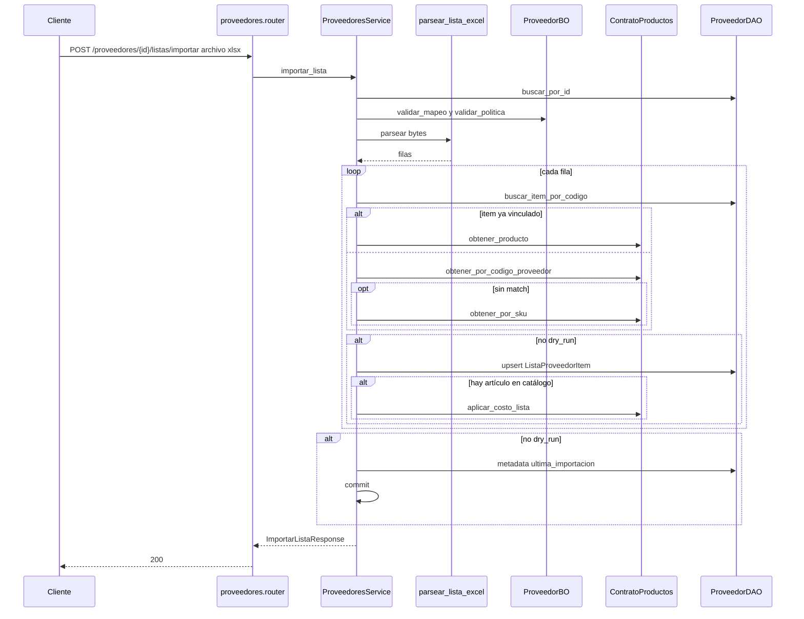

# proveedores — importar lista Excel

Fuente: `app/modulos/proveedores/` · Flujo principal: `POST /api/v1/proveedores/{id}/listas/importar`.
Actualizado: 2026-09-25.

Parsea `.xlsx` / `.xlsm` y **persiste la lista del proveedor** (`proveedores_lista_item`). **No crea artículos** del catálogo.

Match de catálogo (en ese orden): ítem ya vinculado, `Producto.codigo_proveedor`, o `Producto.sku == codigo`. Si hay match: actualiza costo vía `aplicar_costo_lista`. Si no: queda en lista (`sin_match`) hasta `alta` o `vincular`.

`dry_run=true` no persiste. Acepta `mapeo` JSON, `fila_inicio`, `politica_precio_venta` y `margen_venta_pct`.

## Alta al catálogo

`POST /proveedores/{id}/listas/items/{item_id}/alta` con `{ sku, codigo_barras?, precio? }`: el comercio define su SKU y se crea el artículo vía `crear_desde_proveedor`.

`POST .../vincular` asocia un ítem de lista a un artículo ya existente.

## Otros endpoints

| Método | Ruta | operation_id |
|--------|------|----------------|
| GET | `/proveedores` | `listar_proveedores` (paginado; `q`, `activo`) |
| GET | `/proveedores/{id}` | `obtener_proveedor` |
| POST | `/proveedores` | `crear_proveedor` |
| PUT | `/proveedores/{id}` | `actualizar_proveedor` |
| PATCH | `/proveedores/{id}/desactivar` | `desactivar_proveedor` |
| POST | `/proveedores/{id}/listas/importar` | `importar_lista_proveedor` |
| GET | `/proveedores/{id}/listas/items` | `listar_items_lista_proveedor` (`q`, `solo_sin_match`) |
| POST | `/proveedores/{id}/listas/items/{item_id}/alta` | `alta_articulo_desde_lista` |
| POST | `/proveedores/{id}/listas/items/{item_id}/vincular` | `vincular_item_lista_articulo` |

Permiso: módulo `compras`.

## Contrato público

`ContratoProveedores.existe_proveedor`, `obtener_item`, `obtener_item_por_id`. Usado por **compras** y **pagos**. El ciclo comercial (pedido → remito → factura) está en [compras.md](compras.md).
