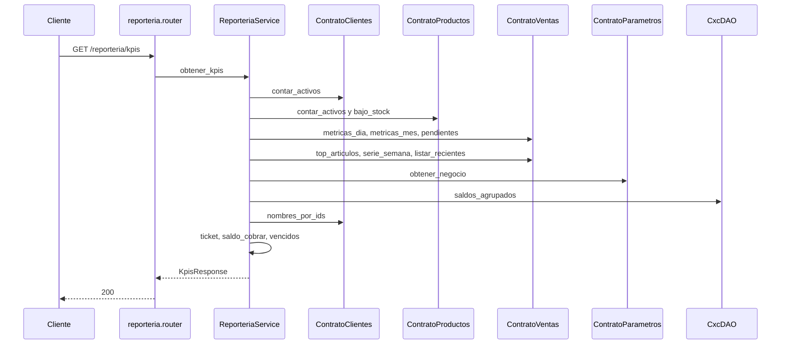

# reporteria — KPIs

Fuente: `app/modulos/reporteria/` · Flujo principal: `GET /api/v1/reporteria/kpis`.
Actualizado: 2026-08-27.

Solo lectura: agrega métricas vía contratos. No persiste ni publica eventos. Un comercio nuevo recibe ceros reales (sin números de demo).

Incluye: ventas día/mes, ticket promedio, pendientes, moneda, top artículos, serie de la semana, últimos comprobantes, reposición, CxC a cobrar/vencido.

Hoy `saldos_agrupados` se lee del DAO de cxc (el contrato público no expone ese agregado).

No hay `contrato.py` ni DAO propio: el módulo es un compositor de contratos.
