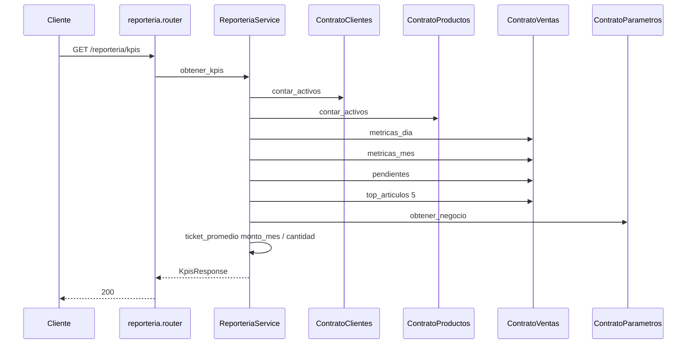

# reporteria — KPIs

Fuente: `app/modulos/reporteria/` · Flujo principal: `GET /api/v1/reporteria/kpis`.
Actualizado: 2026-08-26.

Solo lectura: agrega métricas vía contratos. No persiste ni publica eventos.

Incluye: ventas día/mes, ticket promedio, pedidos/remitos pendientes, remitos por facturar, moneda, top artículos.

No hay `contrato.py` ni DAO propio: el módulo es un compositor de contratos.
