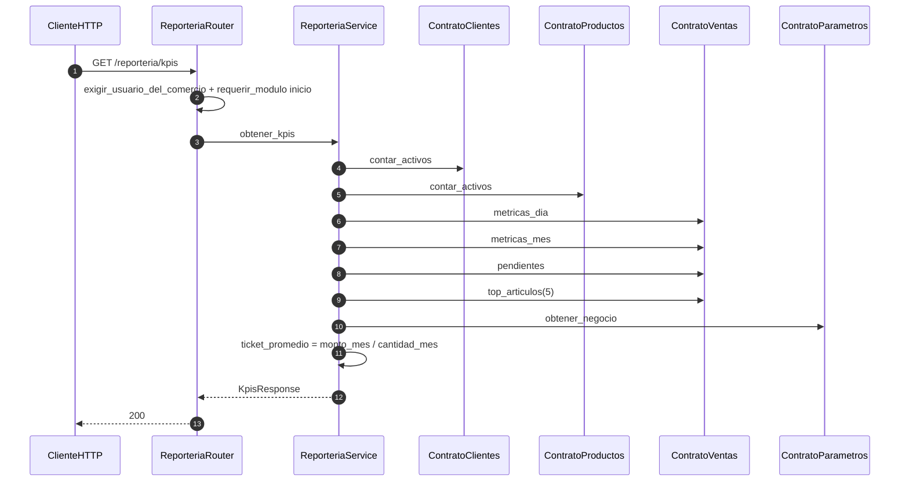

# reporteria — KPIs del dashboard

Prefijo: `/api/v1/reporteria`. Módulo HTTP: `inicio`.
Fuentes: `app/modulos/reporteria/{router,service,schemas}.py`.

## GET /reporteria/kpis (`operation_id`: `obtener_kpis`)

Solo lectura: no persiste ni publica eventos. Agrega métricas vía contratos (sin importar DAO ajenos).
