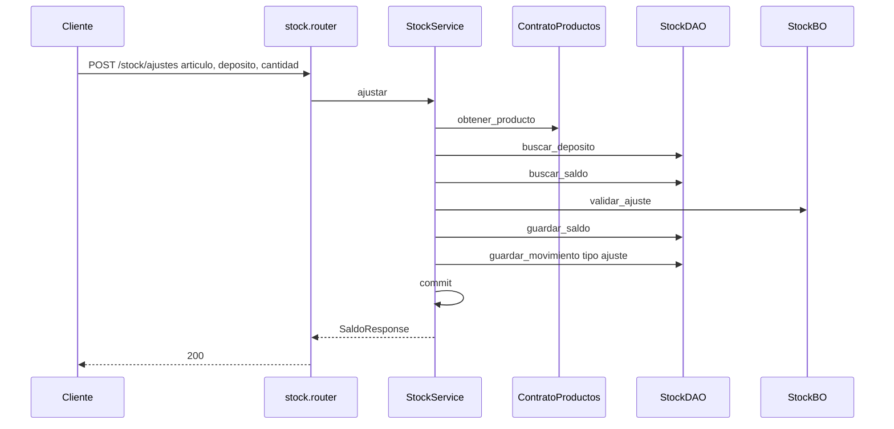
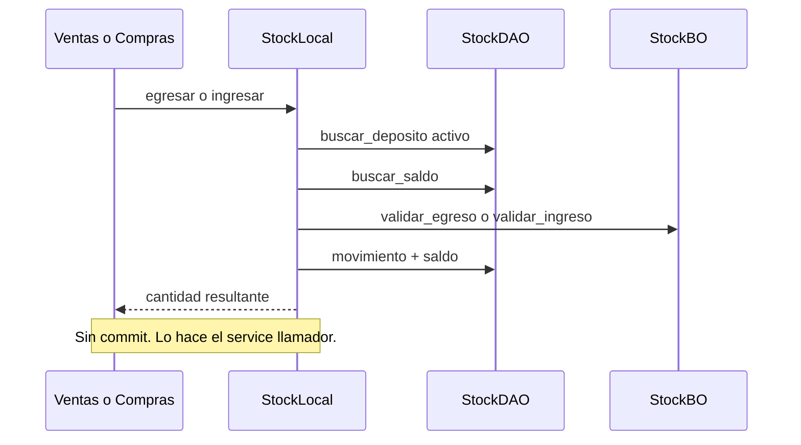

# stock — ajuste

Fuente: `app/modulos/stock/` · Flujo principal: `POST /api/v1/stock/ajustes`.
Actualizado: 2026-08-26.

Ajuste relativo (positivo o negativo) sobre saldo de artículo × depósito. Egresos/ingresos de comprobantes van por contrato (`egresar` / `ingresar`) sin commit propio.

## Contrato (llamado por ventas/compras/productos)

## Otros endpoints

| Método | Ruta | operation_id |
|--------|------|----------------|
| GET/POST/PUT/PATCH | `/stock/depositos` | CRUD depósitos |
| GET | `/stock/articulos/{id}/saldos` | `listar_saldos_articulo` |
| GET | `/stock/depositos/{id}/inventario` | `listar_inventario_deposito` (migra stock plano legacy) |
