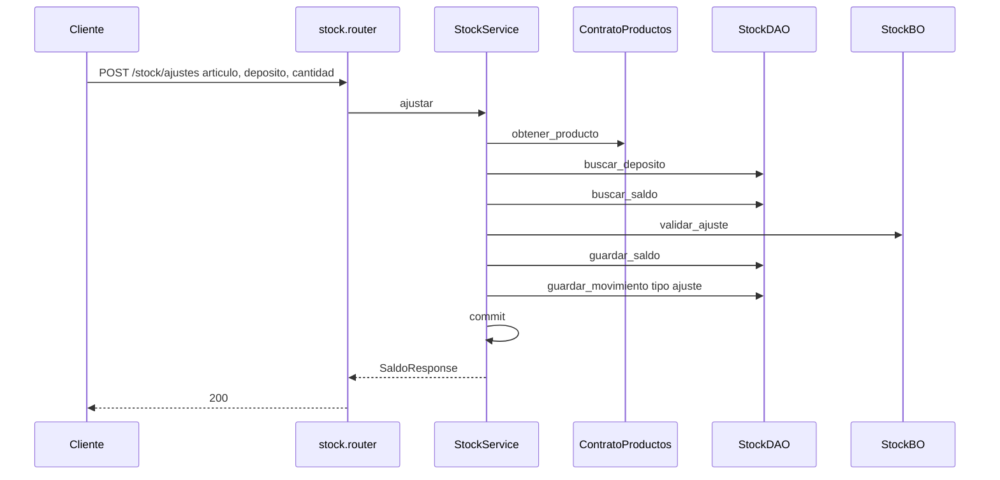
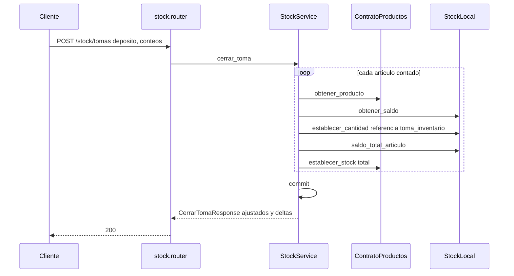
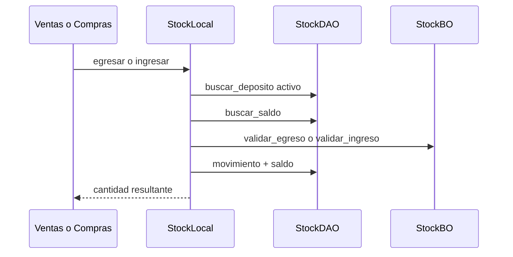

# stock — ajuste y toma de inventario

Fuente: `app/modulos/stock/` · Flujo principal: `POST /api/v1/stock/ajustes`. También: `POST /api/v1/stock/tomas`.
Actualizado: 2026-08-27.

Ajuste relativo (positivo o negativo) sobre saldo de artículo × depósito. Egresos/ingresos de comprobantes van por contrato (`egresar` / `ingresar`) sin commit propio. La toma deja el saldo en las cantidades contadas y sincroniza el stock plano del catálogo.

## Cerrar toma de inventario

## Contrato (llamado por ventas/compras/productos)

Sin commit. Lo hace el service llamador.

## Otros endpoints

| Método | Ruta | operation_id |
|--------|------|----------------|
| GET/POST/PUT/PATCH | `/stock/depositos` | CRUD depósitos |
| GET | `/stock/articulos/{id}/saldos` | `listar_saldos_articulo` |
| GET | `/stock/depositos/{id}/inventario` | `listar_inventario_deposito` (migra stock plano legacy) |
| POST | `/stock/ajustes` | `ajustar_stock` |
| POST | `/stock/tomas` | `cerrar_toma_inventario` |
