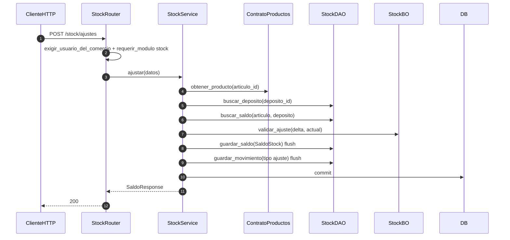

# stock — ajuste de inventario

Prefijo: `/api/v1/stock`. Módulo HTTP: `stock`.
Fuentes: `app/modulos/stock/{router,service,bo,dao,contrato}.py`.

## POST /stock/ajustes (`operation_id`: `ajustar_stock`)

## Contrato (sin commit propio)

`ContratoStock.egresar` / `ingresar` / `establecer_cantidad` — llamados por ventas, compras y productos; el commit lo hace el service orquestador.

Usa `ContratoProductos`. Expone `ContratoStock`.
