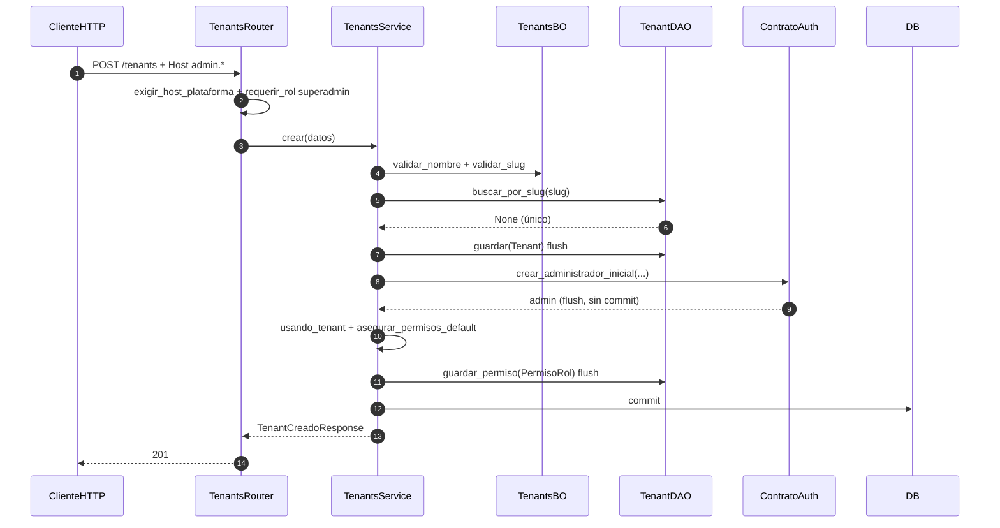

# tenants — alta de comercio (plataforma)

Prefijo: `/api/v1/tenants` (público, plataforma y comercio).
Fuentes: `app/modulos/tenants/{router,service,bo,dao,contrato,dependencias,host}.py`.

## POST /tenants (`operation_id`: `crear_tenant`) — solo superadmin en `admin.*`

## GET /tenants/contexto (`operation_id`: `contexto_tenant_host`) — público

`hostname_desde_request` → `TenantsBO.clasificar_host` → si slug de comercio: `TenantDAO.buscar_por_slug`.

Contrato expuesto: `ContratoTenants`. Usa `ContratoAuth`.
