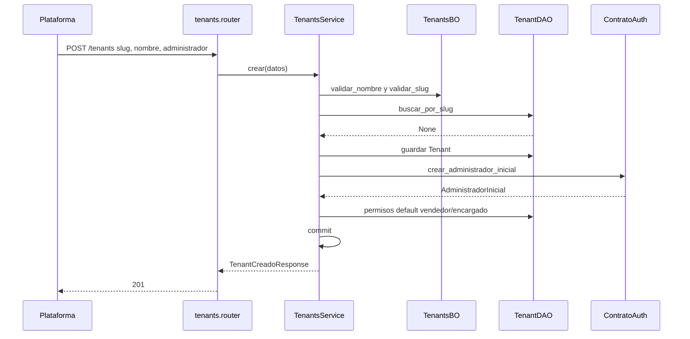
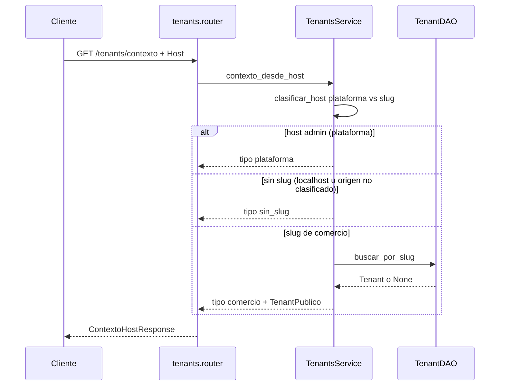

# tenants — crear comercio

Fuente: `app/modulos/tenants/` · Flujo principal: `POST /api/v1/tenants` (host `admin.*`, rol `superadmin`).
Actualizado: 2026-09-24.

Alta de comercio + primer administrador + matriz de permisos default, **una transacción**. Los permisos se escriben con `usando_tenant(tenant.id)`.

## Contexto de Host (público)

Hostname: `X-Forwarded-Host` / `X-Original-Host`, luego Origin, Referer y Host (`hostname_desde_request`). Puede devolver `plataforma`, `comercio` o `sin_slug`.

## Otros endpoints

| Método | Ruta | Quién | operation_id |
|--------|------|-------|----------------|
| GET | `/tenants/contexto` | público | `contexto_tenant_host` |
| GET | `/tenants` | superadmin | `listar_tenants` |
| POST | `/tenants` | superadmin | `crear_tenant` |
| GET | `/tenants/{id}` | superadmin | `obtener_tenant` (ficha + usuarios) |
| PATCH | `/tenants/{id}` | superadmin | `actualizar_tenant` (nombre/activo; slug inmutable) |
| PATCH | `/tenants/{id}/usuarios/{uid}/password` | superadmin | `cambiar_password_usuario_tenant` |
| GET | `/tenants/permisos` | comercio + módulo configuracion | `obtener_matriz_permisos` |
| PUT | `/tenants/permisos` | comercio + módulo configuracion | `actualizar_matriz_permisos` |

## Contrato público

`ContratoTenants`: `obtener_por_id`, `obtener_por_slug`, `existe_tenant`, `contexto_desde_host`, `modulos_habilitados`.

Usado por **auth** (login/perfil). El webhook n8n de **ia** llama `TenantsService.obtener_por_slug` en el mismo proceso (sin contrato).
