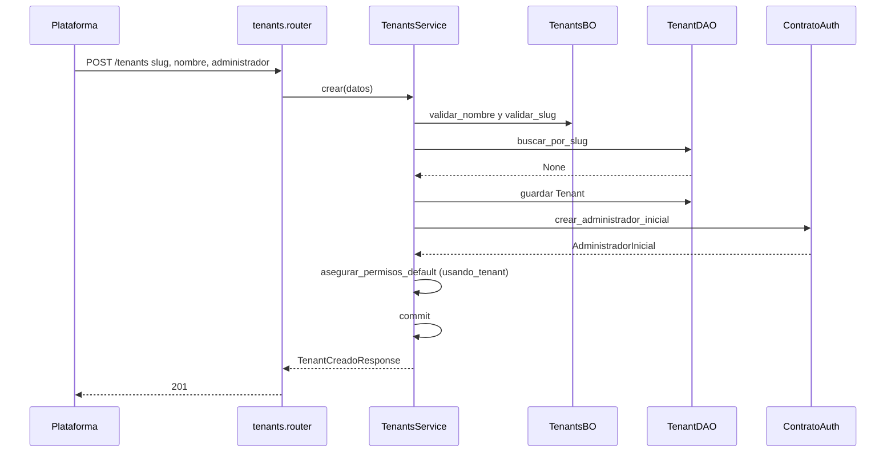
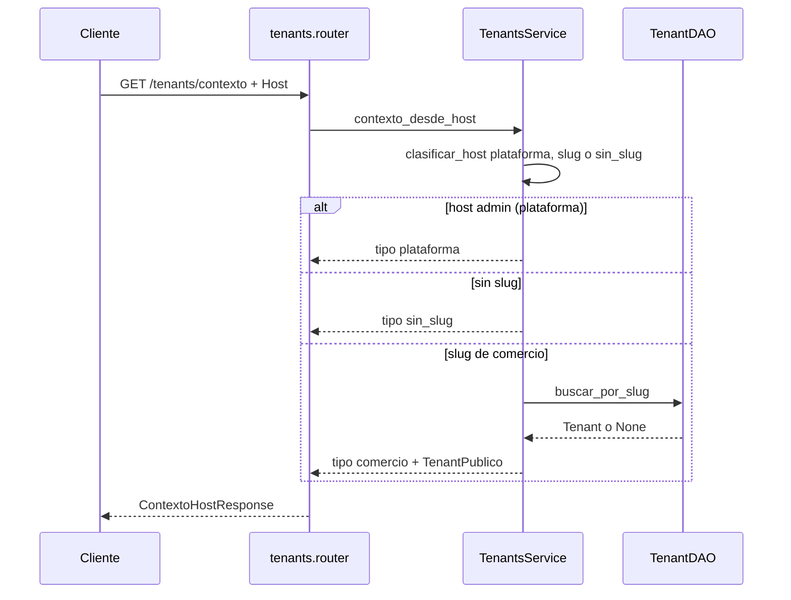

# tenants — crear comercio

Fuente: `app/modulos/tenants/` · Flujo principal: `POST /api/v1/tenants` (host `admin.*`, rol `superadmin`).
Actualizado: 2026-09-19.

Alta de comercio + primer administrador + matriz de permisos default, **una transacción**.

## Contexto de Host (público)

## Otros endpoints

| Método | Ruta | Quién | operation_id |
|--------|------|-------|----------------|
| GET | `/tenants/contexto` | público (Host) | `contexto_tenant_host` |
| GET | `/tenants` | superadmin | `listar_tenants` |
| POST | `/tenants` | superadmin | `crear_tenant` |
| GET | `/tenants/{tenant_id}` | superadmin | `obtener_tenant` |
| PATCH | `/tenants/{tenant_id}` | superadmin | `actualizar_tenant` |
| PATCH | `/tenants/{tenant_id}/usuarios/{usuario_id}/password` | superadmin | `cambiar_password_usuario_tenant` |
| GET | `/tenants/permisos` | comercio + módulo configuracion | `obtener_matriz_permisos` |
| PUT | `/tenants/permisos` | comercio + módulo configuracion | `actualizar_matriz_permisos` |

## Contrato público

`ContratoTenants`: `obtener_por_id`, `obtener_por_slug`, `existe_tenant`, `contexto_desde_host`, `modulos_habilitados`. Usado por **auth** (login/perfil). El webhook n8n de **ia** llama `TenantsService.obtener_por_slug` (mismo proceso, sin contrato).
